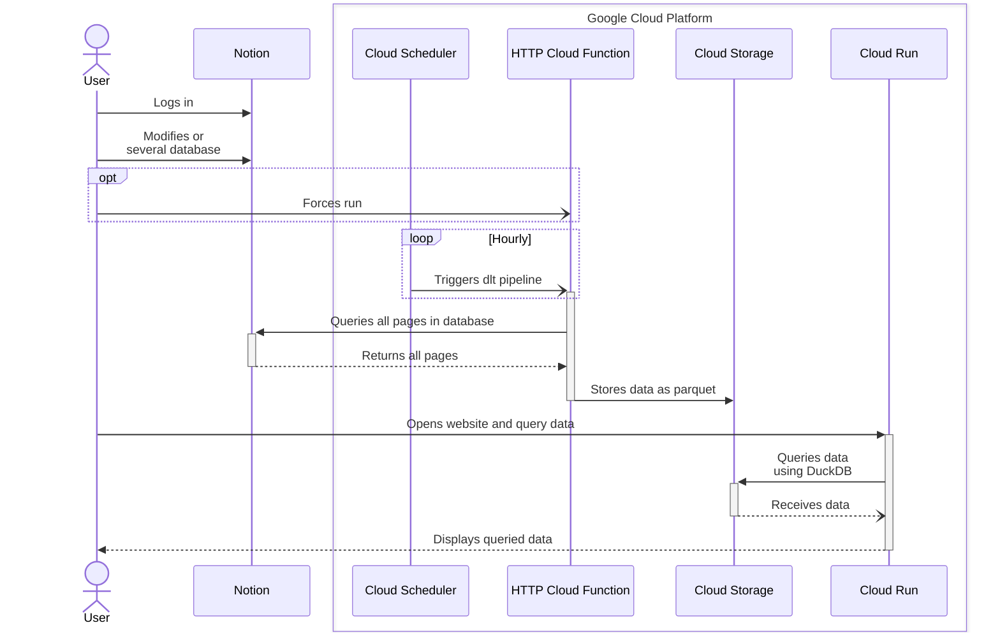

<!-- Improved compatibility of back to top link: See: https://github.com/othneildrew/Best-README-Template/pull/73 -->
<a name="readme-top"></a>

<!-- PROJECT LOGO -->
<br />
<div align="center">
  <!-- <a href="https://github.com/tucared/lakehouse-starter">
    
  </a> -->

<h1 align="center">Lakehouse Starter</h1>

  <strong><p align="center">
    A production-ready lakehouse template using Terraform, DLT, and Streamlit on GCP.</strong>
  </p>
</div>

<!-- TABLE OF CONTENTS -->
<details>
  <summary>Table of Contents</summary>
  <ol>
    <li>
      <a href="#about-the-project">About The Project</a>
      <ul>
        <li><a href="#built-with">Built With</a></li>
      </ul>
    </li>
    <li>
      <a href="#getting-started">Getting Started</a>
      <ul>
        <li><a href="#prerequisites">Prerequisites</a></li>
        <li><a href="#installation">Installation</a></li>
            <ul>
                <li><a href="#setup-your-notion-database">Setup your Notion database</a></li>
                <li><a href="#setup-your-local-repository">Setup your local repository</a></li>
                <li><a href="#create-a-billing-enabled-google-cloud-project">Create a billing-enabled Google Cloud project</a></li>
                <li><a href="#setup-account-impersonation-when-running-terragruntopentofu">Setup account impersonation when running Terragrunt/OpenTofu</a></li>
                <li><a href="#deploy-your-infrastructure">Deploy your infrastructure</a></li>
            </ul>
        <li><a href="#clean-up">Clean-up</a></li>
      </ul>
    </li>
    <li>
        <a href="#usage">Usage</a>
        <ul>
            <li><a href="#invoking-function-to-ingest-new-data">Invoking function to ingest new data</a></li>
            <li><a href="#visualising-logs-and-metadata">Visualising logs and metadata</a></li>
            <li><a href="#sequence-diagram">Sequence diagram</a></li>
        </ul>
    </li>
    <li><a href="#roadmap">Roadmap</a></li>
    <li>
        <a href="#watch-costs-using-infracost">Watch costs using Infracost</a>
    </li>
    <li><a href="#contributing">Contributing</a></li>
    <li><a href="#license">License</a></li>
    <li><a href="#contact">Contact</a></li>
  </ol>
</details>

<!-- ABOUT THE PROJECT -->
## About The Project

This project provides a production-ready lakehouse template using Terraform, DLT, and Streamlit on GCP. Start with Notion data ingestion and customize for your needs.

> [!NOTE]
> When deployed as provided, this project remains within GCP's free tier limits.

The main features of this project are:

- Infrastructure-as-code deployment using Terraform on Google Cloud Platform
- Modular data ingestion pipeline powered by DLT, starting with Notion as a data source
- SQL-based analytics using DuckDB for efficient querying of data files
- Interactive data exploration through a Streamlit web application
- Extensible architecture designed for easy customization and addition of new data sources
- Cost-optimized implementation staying within GCP's free tier limits

This template demonstrates modern data engineering practices while maintaining a simple, understandable structure that can be used as a foundation for your own data platform.

<p align="right">(<a href="#readme-top">back to top</a>)</p>

### Built With

- [![OpenTofu][OpenTofu.org]][OpenTofu-url]
- [![Google Cloud][Console.cloud.google.com]][Google-Cloud-url]
- [![Terragrunt][Terragrunt.io]][Terragrunt-url]
- [![Python][Python.org]][Python-url]
- [![Streamlit][Streamlit.io]][Streamlit-url]
- [![Notion][Notion.so]][Notion-url]

<p align="right">(<a href="#readme-top">back to top</a>)</p>

<!-- GETTING STARTED -->
## Getting Started

To get a copy of the project up and running follow the steps below.

### Prerequisites

- A [Notion account]
- A [Google Cloud billing account]
- Have [gcloud CLI] installed
- Have [OpenTofu] installed
- Have [Terragrunt] installed

<p align="right">(<a href="#readme-top">back to top</a>)</p>

### Installation

#### Setup your Notion database

1. [Setup an internal Notion integration] with **Read content** capability, and [add it as a connection to your database].

#### Setup your local repository

1. Duplicate the `terragrunt/example` folder and rename it to `terragrunt/prod`.

     ```shell
     cp -a terragrunt/example terragrunt/prod
     ```

2. Edit values from `terragrunt/prod/env_vars.yaml` as followed:
   - **project_id**: A globally unique identifier for your project.
     > See [how to pick a project ID].
   - **notion_database_id**: The globally unique identifier for the Notion database created in step 1.
     > See [how to retrieve a database ID].
   - **notion_secret_value**: The unique internal integration token for the Notion integration created in step 2.
     > See [how to retrieve an integration token][Setup an internal Notion integration].

#### Create a billing-enabled Google Cloud project

1. Set billing account ID variable in shell
   > **BILLING_ACCOUNT_ID** can be found using `gcloud beta billing accounts list`

   ```shell
   export BILLING_ACCOUNT_ID=...
   ```

2. Create project, link billing account and enable relevant APIs

   ```shell
   cd terragrunt/prod

   export PROJECT_ID=$(grep "project_id" env_vars.yaml | awk '{print $2}' | tr -d '"')
   gcloud projects create $PROJECT_ID
   gcloud beta billing projects link $PROJECT_ID --billing-account=$BILLING_ACCOUNT_ID

   gcloud services enable secretmanager.googleapis.com --project=$PROJECT_ID
   gcloud services enable cloudfunctions.googleapis.com --project=$PROJECT_ID
   gcloud services enable cloudscheduler.googleapis.com --project=$PROJECT_ID
   gcloud services enable run.googleapis.com --project=$PROJECT_ID
   gcloud services enable cloudbuild.googleapis.com --project=$PROJECT_ID
   gcloud services enable artifactregistry.googleapis.com --project=$PROJECT_ID
   gcloud services enable iam.googleapis.com --project=$PROJECT_ID
   gcloud services enable cloudresourcemanager.googleapis.com --project=$PROJECT_ID
   ```

#### Setup account impersonation when running Terragrunt/OpenTofu

1. Unset any previous Google credentials set.

    ```shell
    unset GOOGLE_CREDENTIALS
    gcloud auth application-default login --no-launch-browser
    ```

2. Create a service account used for impersonation.

    ```shell
    cd terragrunt/prod
    ```

    <details><summary><b>Long shell command to execute</b></summary>

    ```shell
    export PROJECT_ID=$(grep "project_id" env_vars.yaml | awk '{print $2}' | tr -d '"')
    export TOFU_SERVICE_ACCOUNT=$(grep "sa_tofu" env_vars.yaml | awk '{print $2}' | tr -d '"')
    export USER_ACCOUNT_ID=$(echo `gcloud config get core/account`)

    gcloud iam service-accounts create $TOFU_SERVICE_ACCOUNT \
        --display-name "OpenTofu SA" \
        --description "Used when running OpenTofu commands" \
        --project $PROJECT_ID

    gcloud projects add-iam-policy-binding $PROJECT_ID \
        --member "serviceAccount:$TOFU_SERVICE_ACCOUNT@$PROJECT_ID.iam.gserviceaccount.com" \
        --project $PROJECT_ID \
        --role "roles/editor"

    gcloud projects add-iam-policy-binding $PROJECT_ID \
        --member "serviceAccount:$TOFU_SERVICE_ACCOUNT@$PROJECT_ID.iam.gserviceaccount.com" \
        --project $PROJECT_ID \
        --role "roles/secretmanager.admin"

    gcloud projects add-iam-policy-binding $PROJECT_ID \
        --member "serviceAccount:$TOFU_SERVICE_ACCOUNT@$PROJECT_ID.iam.gserviceaccount.com" \
        --project $PROJECT_ID \
        --role "roles/bigquery.dataEditor"

    gcloud projects add-iam-policy-binding $PROJECT_ID \
        --member "serviceAccount:$TOFU_SERVICE_ACCOUNT@$PROJECT_ID.iam.gserviceaccount.com" \
        --project $PROJECT_ID \
        --role "roles/iam.serviceAccountCreator"

    gcloud projects add-iam-policy-binding $PROJECT_ID \
        --member "serviceAccount:$TOFU_SERVICE_ACCOUNT@$PROJECT_ID.iam.gserviceaccount.com" \
        --project $PROJECT_ID \
        --role "roles/resourcemanager.projectIamAdmin"

    gcloud projects add-iam-policy-binding $PROJECT_ID \
        --member "serviceAccount:$TOFU_SERVICE_ACCOUNT@$PROJECT_ID.iam.gserviceaccount.com" \
        --project $PROJECT_ID \
        --role "roles/cloudfunctions.admin"

    gcloud projects add-iam-policy-binding $PROJECT_ID \
        --member "serviceAccount:$TOFU_SERVICE_ACCOUNT@$PROJECT_ID.iam.gserviceaccount.com" \
        --project $PROJECT_ID \
        --role "roles/cloudscheduler.admin"

    gcloud projects add-iam-policy-binding $PROJECT_ID \
        --member "serviceAccount:$TOFU_SERVICE_ACCOUNT@$PROJECT_ID.iam.gserviceaccount.com" \
        --project $PROJECT_ID \
        --role "roles/run.admin"

    gcloud iam service-accounts add-iam-policy-binding \
        $TOFU_SERVICE_ACCOUNT@$PROJECT_ID.iam.gserviceaccount.com \
        --project $PROJECT_ID \
        --member "user:$USER_ACCOUNT_ID" \
        --role "roles/iam.serviceAccountTokenCreator"
    ```

    </details>

#### Deploy your infrastructure

1. Deploy infrastructure on cloud

    ```shell
    terragrunt apply

    # Remote state GCS bucket ...-tfstate does not exist [...]. Would you like Terragrunt to create it? (y/n) y

    # Do you want to perform these actions?
    # Enter a value: yes
    ```

2. Trigger streamlit app build and deploy

    ```shell
    gcloud builds triggers run $(terragrunt output streamlit_build_trigger_name | sed 's/"//g') \
        --region=$(terragrunt output streamlit_build_trigger_region | sed 's/"//g')

    gcloud builds list --region=$(terragrunt output streamlit_build_trigger_region | sed 's/"//g')
    ```

<p align="right">(<a href="#readme-top">back to top</a>)</p>

### Clean-up

You have 2 options for cleaning up deployment:

- Either remove all provisionned resources, except for the bucket containing eventual remote state file.

    ```shell
    terragrunt destroy
    # Enter a value: yes
    ```

- Or delete project, and eventual `backend.tf` file.

    ```shell
    gcloud projects delete $PROJECT_ID
    # Do you want to continue (Y/n)?: Y

    rm -rf .terraform.lock.hcl
    rm -rf .terragrunt-cache
    ```

<p align="right">(<a href="#readme-top">back to top</a>)</p>

<!-- USAGE EXAMPLES -->
## Usage

The data flow in this lakehouse architecture follows these steps:

1. **Data Source**:
   - Data is maintained in Notion databases (currently implemented)
   - Can be extended to other sources by modifying the DLT pipeline

2. **Data Ingestion**:
   - Triggered either manually or automatically via Cloud Scheduler
   - Executed through a private HTTP Cloud Function
   - Uses DLT to extract and load data into Cloud Storage

3. **Data Analysis**:
   - Access data through a Streamlit web application hosted on Cloud Run
   - Query data directly from Cloud Storage using DuckDB
   - Explore and analyze data using SQL queries

### Invoking function to ingest new data

Function can be triggered either by invoking it directly or by force running the scheduler that invokes it:

- Calling function directly

    ```shell
    curl -i -X POST $(terragrunt output function_uri | sed 's/"//g') \
        -H "Authorization: bearer $(gcloud auth print-identity-token)"
    ```

- Force running scheduler (must not be paused)

    ```shell
    gcloud scheduler jobs run $(terragrunt output scheduler_dlt_name | sed 's/"//g') \
        --project=$(grep "project_id" env_vars.yaml | awk '{print $2}' | tr -d '"') \
        --location=$(terragrunt output scheduler_append_region | sed 's/"//g')
    ```

<p align="right">(<a href="#readme-top">back to top</a>)</p>

### Visualising logs and metadata

Cloud Function logs:

```shell
gcloud functions logs read $(terragrunt output function_name | sed 's/"//g') \
    --project=$PROJECT_ID \
    --region=$(terragrunt output function_region | sed 's/"//g')
```

<p align="right">(<a href="#readme-top">back to top</a>)</p>

### Sequence diagram



<p align="right">(<a href="#readme-top">back to top</a>)</p>

<!-- ROADMAP -->
## Roadmap

- [ ] Transform the DLT notion pipeline into a OpenTofu/Terraform module
- [ ] Create a branch to a version with embedded dlt to Streamlit (no Cloud Storage)

<p align="right">(<a href="#readme-top">back to top</a>)</p>

### Watch costs using [Infracost]

> [!NOTE]
> When deployed as provided, this project stays within GCP's Free Tier limits, assuming:
>
> - You have no other active GCP projects
> - Your Notion databases are moderate in size (tested with ~3,000 rows without images)

[Infracost] helps you estimate monthly cloud costs by analyzing your Terraform files. To check potential costs before deploying changes:

```shell
export TG_DIR=terragrunt/dev/
infracost breakdown --path=$TG_DIR \
    --usage-file=infracost-usage.yml
```

> [!IMPORTANT]
> Understanding Infracost Results:
>
> - [Infracost ignores] free tiers in its calculations
> - A small cost estimate (few cents) usually means you're still within free tier limits
> - A larger cost estimate may indicate you've exceeded free tier limits
> - Always verify your actual GCP usage alongside Infracost estimates

<p align="right">(<a href="#readme-top">back to top</a>)</p>

<!-- CONTRIBUTING -->
## Contributing

Contributions are what make the open source community such an amazing place to learn, inspire, and create. Any contributions you make are **greatly appreciated**.

If you have a suggestion that would make this better, please fork the repo and create a pull request. You can also simply open an issue with the tag "enhancement".
Don't forget to give the project a star! Thanks again!

1. Fork the Project
2. Create your Feature Branch (`git checkout -b feature/AmazingFeature`)
3. Commit your Changes (`git commit -m 'Add some AmazingFeature'`)
4. Push to the Branch (`git push origin feature/AmazingFeature`)
5. Open a Pull Request

<p align="right">(<a href="#readme-top">back to top</a>)</p>

<!-- LICENSE -->
## License

Distributed under the MIT License. See `LICENSE` for more information.

<p align="right">(<a href="#readme-top">back to top</a>)</p>

<!-- CONTACT -->
## Contact

Tucared - <1v8ufskf@duck.com>

<p align="right">(<a href="#readme-top">back to top</a>)</p>

<!-- MARKDOWN LINKS & IMAGES -->
<!-- https://www.markdownguide.org/basic-syntax/#reference-style-links -->
[OpenTofu.org]: https://img.shields.io/badge/OpenTofu-FFDA18?style=for-the-badge&logo=opentofu&logoColor=black
[OpenTofu-url]: https://opentofu.org/
<!-- https://github.com/simple-icons/simple-icons/issues/7650 -->
[Terragrunt.io]: https://img.shields.io/badge/terragrunt-565AE1?style=for-the-badge&logo=terragrunt
[Terragrunt-url]: https://terragrunt.gruntwork.io/
[Python.org]: https://img.shields.io/badge/Python-FFD43B?style=for-the-badge&logo=python&logoColor=blue
[Python-url]: https://www.python.org/
[Streamlit.io]: https://img.shields.io/badge/Streamlit-FF4B4B?style=for-the-badge&logo=Streamlit&logoColor=blue
[Streamlit-url]: https://streamlit.io/
[Notion.so]: https://img.shields.io/badge/Notion-000000?style=for-the-badge&logo=notion&logoColor=white
[Notion-url]: https://www.notion.so/
[Console.cloud.google.com]: https://img.shields.io/badge/Google_Cloud-4285F4?style=for-the-badge&logo=google-cloud&logoColor=white
[Google-Cloud-url]: https://console.cloud.google.com

[Notion account]: https://www.notion.so/signup
[Google Cloud billing account]: https://cloud.google.com/billing/docs/how-to/create-billing-account
[gcloud CLI]: https://cloud.google.com/sdk/docs/install
[OpenTofu]: https://opentofu.org/docs/intro/install/
[Terragrunt]: https://terragrunt.gruntwork.io/docs/getting-started/install/

[Setup an internal Notion integration]: https://developers.notion.com/docs/authorization#internal-integration-auth-flow-set-up
[add it as a connection to your database]: https://www.notion.so/help/add-and-manage-connections-with-the-api#add-connections-to-pages
[how to retrieve a database ID]: https://developers.notion.com/reference/retrieve-a-database
[how to pick a project ID]: https://cloud.google.com/resource-manager/docs/creating-managing-projects#before_you_begin

[Infracost]: https://github.com/infracost/infracost/tree/master

[Infracost ignores]: https://www.infracost.io/docs/supported_resources/google/
