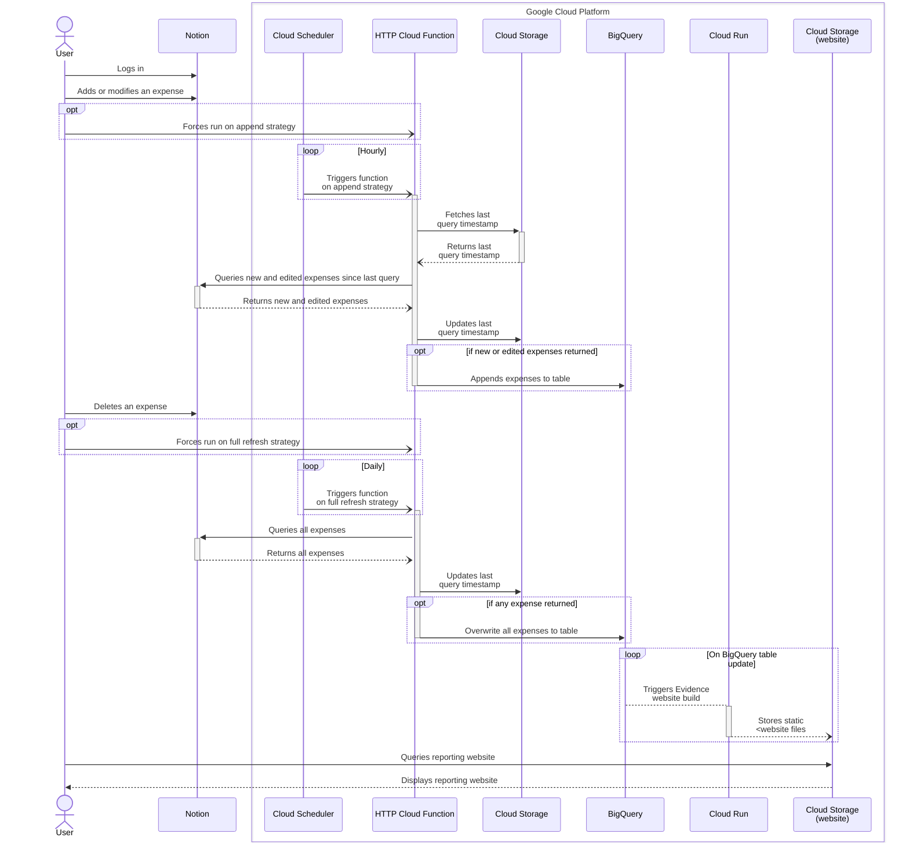

<!-- Improved compatibility of back to top link: See: https://github.com/othneildrew/Best-README-Template/pull/73 -->
<a name="readme-top"></a>

<!-- PROJECT LOGO -->
<br />
<div align="center">
  <!-- <a href="https://github.com/tucared/notion-budget-tracker">
    
  </a> -->

<h1 align="center">Notion Budget Tracker</h1>

  <strong><p align="center">
    Self-hosted expense tracker with reporting website</strong>
    <br />
    <a href="https://www.notion.so/3b78e071709e4a28ab16798de93e12c6?v=e8126179c6b64a029d8e20675dc4e48e">View expense logger demo</a>
    ·
    <a href="https://github.com/tucared/notion-budget-tracker">[TODO] View reporting website demo</a>
  </p>
</div>

<!-- TABLE OF CONTENTS -->
<details>
  <summary>Table of Contents</summary>
  <ol>
    <li>
      <a href="#about-the-project">About The Project</a>
      <ul>
        <li><a href="#built-with">Built With</a></li>
      </ul>
    </li>
    <li>
      <a href="#getting-started">Getting Started</a>
      <ul>
        <li><a href="#prerequisites">Prerequisites</a></li>
        <li><a href="#installation">Installation</a></li>
        <li><a href="#clean-up">Clean-up</a></li>
      </ul>
    </li>
    <li>
        <a href="#usage">Usage</a>
        <ul>
            <li><a href="#invoking-function">Invoking function</a></li>
            <li><a href="#visualising-logs-and-metadata">Visualising logs and metadata</a></li>
            <li><a href="#sequence-diagram">Sequence diagram</a></li>
        </ul>
    </li>
    <li><a href="#roadmap">Roadmap</a></li>
    <li>
        <a href="#local-development">Local development</a>
        <ul>
            <li><a href="#run-function-locally">Run function locally</a></li>
            <li><a href="#watch-costs-using-infracost">Watch costs using Infracost</a></li>
        </ul>
    </li>
    <li><a href="#contributing">Contributing</a></li>
    <li><a href="#license">License</a></li>
    <li><a href="#contact">Contact</a></li>
  </ol>
</details>

<!-- ABOUT THE PROJECT -->
## About The Project

This project aims at providing individuals and groups of individuals with a lightweight solution to record expenses and visualise related insights to drive better financial decisions.

The main requirements for the project are:

- Reduce user friction regarding transactions data collection.
- Integrate with a wide variety of banks, regardless of digitalisation or regulatory frameworks.
- Be conscious of data privacy and of data security.
- Allow for expense metadata fields customisation, initially aimed at expense categories.
- Be free, or extremely low price.

<p align="right">(<a href="#readme-top">back to top</a>)</p>

### Built With

- [![OpenTofu][OpenTofu.org]][OpenTofu-url]
- [![Python][Python.org]][Python-url]
- [![Notion][Notion.so]][Notion-url] _(free tier)_
- [![Google Cloud][Console.cloud.google.com]][Google-Cloud-url] _(free tier)_

<p align="right">(<a href="#readme-top">back to top</a>)</p>

<!-- GETTING STARTED -->
## Getting Started

To get a copy of the project up and running follow the steps below.

### Prerequisites

- A [Notion account]
- A [Google Cloud billing account]
- Have [gcloud CLI] installed
- Have [OpenTofu] installed

<p align="right">(<a href="#readme-top">back to top</a>)</p>

### Installation

1. Duplicate this [Notion public template database] into a Workspace you own.

2. [Setup an internal Notion integration] with **Read content** capability, and [add it as a connection to your database].

3. Duplicate `example.tfvars` file into a `terraform.tfvars` one, and modify following variables:
   - **notion_database_id**: The globally unique identifier for the Notion database created step 1.
     > See [how to retrieve a database ID].
   - **notion_secret_value**: The unique internal integration token for the Notion integration created step 2.
     > See [how to retrieve an integration token][Setup an internal Notion integration].
   - **project_id**: A globally unique identifier for your project.
     > See [how to pick a project ID].

4. Initialise OpenTofu.

    ```shell
    tofu init
    ```

5. Create a billing-enabled Google Cloud project.
   1. Create project based on **PROJECT_ID** variable from `terraform.tfvars` file

        ```shell
        export PROJECT_ID=$(echo var.project_id | tofu console | sed 's/"//g')
        gcloud projects create $PROJECT_ID
        ```

   2. Link billing account to project
        > **BILLING_ACCOUNT_ID** can be found using `gcloud beta billing accounts list`

        ```shell
        export BILLING_ACCOUNT_ID=...
        gcloud beta billing projects link $PROJECT_ID --billing-account=$BILLING_ACCOUNT_ID
        ```

   3. Enable relevant APIs

        ```shell
        gcloud services enable secretmanager.googleapis.com --project=$PROJECT_ID
        gcloud services enable cloudfunctions.googleapis.com --project=$PROJECT_ID
        gcloud services enable cloudscheduler.googleapis.com --project=$PROJECT_ID
        gcloud services enable run.googleapis.com --project=$PROJECT_ID
        gcloud services enable cloudbuild.googleapis.com --project=$PROJECT_ID
        gcloud services enable artifactregistry.googleapis.com --project=$PROJECT_ID
        gcloud services enable iam.googleapis.com --project=$PROJECT_ID
        gcloud services enable cloudresourcemanager.googleapis.com --project=$PROJECT_ID
        ```

6. Unset any previous Google credentials set.

    ```shell
    unset GOOGLE_CREDENTIALS  
    gcloud auth application-default login --no-launch-browser 
    ```

7. Create a service account to run OpenTofu with.

    ```shell
    export USER_ACCOUNT_ID=`gcloud config get core/account`
    export TOFU_SERVICE_ACCOUNT=$(echo var.sa_tofu | tofu console | sed 's/"//g')

    gcloud iam service-accounts create $TOFU_SERVICE_ACCOUNT \
        --display-name "OpenTofu SA" \
        --description "Used when running OpenTofu commands" \
        --project $PROJECT_ID

    gcloud projects add-iam-policy-binding $PROJECT_ID \
        --member "serviceAccount:$TOFU_SERVICE_ACCOUNT@$PROJECT_ID.iam.gserviceaccount.com" \
        --role "roles/editor" \
        --role "roles/secretmanager.admin"

    gcloud iam service-accounts add-iam-policy-binding \
        $TOFU_SERVICE_ACCOUNT@$PROJECT_ID.iam.gserviceaccount.com \
        --project $PROJECT_ID \
        --member "user:$USER_ACCOUNT_ID" \
        --role "roles/iam.serviceAccountTokenCreator" 
    ```

8. Deploy infrastructure on Google Cloud.

    ```shell
    tofu apply
    # Enter a value: yes
    ```

9. Add role `run.invoker` to service account linked to Cloud Scheduler to complete deployment.

    ```shell
    gcloud functions add-invoker-policy-binding $(tofu output function_name | sed 's/"//g') \
        --project=$PROJECT_ID \
        --region=$(tofu output function_region | sed 's/"//g') \
        --member serviceAccount:$(tofu output sa_email_cloud_scheduler | sed 's/"//g')
    ```

    > See <https://github.com/hashicorp/terraform-provider-google/issues/15264>

10. _(Optional, recommended)_ Save state file to a remote backend.
    <details><summary><strong>Steps</strong></summary>

    1. Create a `backend.tf` file containing the following:

        ```terraform
        terraform {
            backend "gcs" {
              bucket = "<output from shell command 'tofu output bucket_tfstate'>"
              prefix = "terraform/state"
              impersonate_service_account = "<output from shell command 'tofu output sa_email_tofu'>"
            }
        }
        ```

    2. Migrate state file to remote backend.

        ```shell
        tofu init -migrate-state
        ```

    3. Remove leftover local state files.

        ```shell
        rm -rf terraform.tfstate
        rm -rf terraform.tfstate.backup
        ```

    </details>

<p align="right">(<a href="#readme-top">back to top</a>)</p>

### Clean-up

You have 2 options for cleaning up deployment:

- Either remove all provisionned resources, except for the bucket containing eventual remote state file.

    ```shell
    tofu destroy
    # Enter a value: yes
    ```

- Or delete project, and eventual `backend.tf` file.

    ```shell
    gcloud projects delete $PROJECT_ID
    # Do you want to continue (Y/n)?: Y

    rm -rf backend.tf
    ```

<p align="right">(<a href="#readme-top">back to top</a>)</p>

<!-- USAGE EXAMPLES -->
## Usage

- The **User** manually logs each expense as a [Page] in a [Notion database] with some metadata.
- Either the User, or the **Cloud Scheduler**, invokes a private **HTTP Cloud Function** to extract either all or new and updated Pages from aforementioned Notion database, then loads them into a **BigQuery** native table.
- **TODO**: An **[Evidence.dev]** IAM-protected static website provides visualisations, built each time BigQuery table data is updated.

### Invoking function

Function can be triggered either by invoking it directly or by force running the scheduler that invokes it:

- Calling function directly (append strategy)

    ```shell
    curl -i -X POST $(tofu output function_uri | sed 's/"//g') \
        -H "Authorization: bearer $(gcloud auth print-identity-token)"
    ```

- Calling function directly (full refresh strategy)

    ```shell
    curl -i -X POST $(tofu output function_uri | sed 's/"//g')\?full_refresh=true \
        -H "Authorization: bearer $(gcloud auth print-identity-token)"
    ```

- Force running scheduler (append strategy)

    ```shell
    gcloud scheduler jobs run $(tofu output scheduler_append_name | sed 's/"//g') \
        --project=$PROJECT_ID \
        --location=$(tofu output scheduler_append_region | sed 's/"//g')
    ```

- Force running scheduler (full refresh strategy)
  
    ```shell
    gcloud scheduler jobs run $(tofu output scheduler_full_refresh_name | sed 's/"//g') \
        --project=$PROJECT_ID \
        --location=$(tofu output scheduler_full_refresh_region | sed 's/"//g')
    ```

<p align="right">(<a href="#readme-top">back to top</a>)</p>

### Visualising logs and metadata

Cloud Function logs:

```shell
gcloud functions logs read $(tofu output function_name | sed 's/"//g') \
    --project=$PROJECT_ID \
    --region=$(tofu output function_region | sed 's/"//g')
```

Destination table metadata, including last updated time:

```shell
bq show $(tofu output bq_table_id_colon | sed 's/"//g')
```

Recent additions to destination table:

```shell
bq query --use_legacy_sql=false \
    "SELECT
        id,
        url,
        created_time,
        last_edited_time
    FROM
        \`$(tofu output bq_table_id | sed 's/"//g')\`
    ORDER BY last_edited_time DESC
    LIMIT 10;"
```

<p align="right">(<a href="#readme-top">back to top</a>)</p>

### Sequence diagram



<p align="right">(<a href="#readme-top">back to top</a>)</p>

<!-- ROADMAP -->
## Roadmap

- [ ] Add visualisation using [Evidence.dev]
- [ ] Add [SimpleFIN Bridge] for automated transaction collection
- [ ] Add budgeting feature (target versus actual)

<p align="right">(<a href="#readme-top">back to top</a>)</p>

<!-- HOW TO DEVELOP LOCALLY -->
## Local development

### Run function locally

There are 2 ways of testing for function source changes on overall infrastructure:

1. Redeploy function based on new source to an existing infrastructure, then [invoke it](#invoking-function).
2. Deploy a _development_ infrastructure on another project, then run function locally using [`functions-framework`].

Though the latter option is recommended for most cases, some may prefer the first option if they do not have a deployed production infrastructure and do not wish to setup a local development environment.

Follow steps below to create another infrastructure and running function locally:

1. Duplicate your production `terraform.tfvars` to a `dev.tfvars`.

   1. Set **cloud_schedulers_parameters.paused** value to `true`. This prevents Cloud Schedulers from triggering the _deployed_ function.

   2. Set **project_id** to another value for your _development_ Google Cloud project.

2. If you have a `backend.tf` file, comment all its contents while working on the _development_ infrastructure.

3. Initialise OpenTofu.

    ```shell
    tofu init
    ```

4. Create Google Cloud project the same way that step 5 from [Installation](#installation) while changing first step to:

    ```shell
    export PROJECT_ID=$(echo var.project_id | tofu console -var-file=dev.tfvars | sed 's/"//g')
    gcloud projects create $PROJECT_ID
    ```

5. Deploy new infrastructure on Google Cloud.

    ```shell
    tofu apply -var-file=dev.tfvars
    # Enter a value: yes
    ```

6. Download service account key file that will be used by Cloud Function locally

    ```shell
    export GOOGLE_APPLICATION_CREDENTIALS_PATH=secrets/sa-cloud-function-private-key.json
    gcloud iam service-accounts keys create $GOOGLE_APPLICATION_CREDENTIALS_PATH \
        --iam-account=$(tofu output sa_email_cloud_function | sed 's/"//g')
    ```

7. [Create a virtual environment and] install dependencies.

    ```shell
    export SOURCE=$(echo var.cloud_function_parameters.source | tofu console | sed 's/"//g')
    pip install -r $SOURCE/requirements.txt
    pip install -r $SOURCE/requirements.local.txt
    ```

8. Start local server.

    ```shell
    export BQ_TABLE_ID=$(tofu output bq_table_id | sed 's/"//g')
    export DESTINATION_BLOB_NAME_STATE_FILE=$(echo var.destination_state_file | tofu console | sed 's/"//g')
    export ENTRYPOINT=$(echo var.cloud_function_parameters.entrypoint | tofu console | sed 's/"//g')
    export NOTION_DATABASE_ID=$(echo var.notion_database_id | tofu console | sed 's/"//g')
    export GSM_NOTION_SECRET_NAME=$(echo var.gsm_notion_secret_name | tofu console | sed 's/"//g')
    export BUCKET_NAME=$(tofu output bucket_name | sed 's/"//g')

    GOOGLE_APPLICATION_CREDENTIALS=$(echo $GOOGLE_APPLICATION_CREDENTIALS_PATH) GOOGLE_CLOUD_PROJECT=$(echo $PROJECT_ID) functions-framework \
        --target=$ENTRYPOINT \
        --source=$SOURCE/main.py \
        --debug
    ```

    > Source changes are automatically loaded to local server, meaning you can code the function and invoking its latest version without restarting the local server.

9. Open another shell, and invoke function locally.

    ```shell
    curl localhost:8080
    ```

10. Once done, destroy deployment (or delete project) and revert back to _production_ environment by:

    - Destroying deployment and local state files.

        ```shell
        tofu destroy # or: gcloud projects delete $PROJECT_ID
        rm -rf dev.tfstate
        rm -rf dev.tfstate.backup
        ```

    - Eventually uncomment contents from the `backend.tf` file.
  
    - Initialising `tofu` back to _production_ project.

        ```shell
        tofu init
        ```

<p align="right">(<a href="#readme-top">back to top</a>)</p>

### Watch costs using [Infracost]

> [!NOTE]
> As mentionned earlier, **deploying this infrastructure costs nothing as it leverages Google Cloud Free Tier**.

[Infracost] is a CLI-based tool that provides a cloud monthly cost estimate from `.tf` files and a [`infracost-usage.yml`](infracost-usage.yml) file.

When modifying resources, before deploying resources or commiting to repo, it can be insightful to use Infracost to highlight costs spikes:

```shell
infracost breakdown --path=. \
    --usage-file=infracost-usage.yml \
    --terraform-var-file=terraform.tfvars
```

> [!IMPORTANT]
> [Infracost specifies] free trials and free tiers, which are usually **not** a significant part of cloud costs, are ignored.
> Meaning Infracost is intended as a necessary, but unsufficient tool:
>
> - It will most likely display a non-zero cost;
>
> - If this cost is low (i.e., few cents), you should still verify your usage remains within the Free tier;
>
> - If this cost is high, this may indicate you are not under Free Tier anymore.

<p align="right">(<a href="#readme-top">back to top</a>)</p>

<!-- CONTRIBUTING -->
## Contributing

Contributions are what make the open source community such an amazing place to learn, inspire, and create. Any contributions you make are **greatly appreciated**.

If you have a suggestion that would make this better, please fork the repo and create a pull request. You can also simply open an issue with the tag "enhancement".
Don't forget to give the project a star! Thanks again!

1. Fork the Project
2. Create your Feature Branch (`git checkout -b feature/AmazingFeature`)
3. Commit your Changes (`git commit -m 'Add some AmazingFeature'`)
4. Push to the Branch (`git push origin feature/AmazingFeature`)
5. Open a Pull Request

<p align="right">(<a href="#readme-top">back to top</a>)</p>

<!-- LICENSE -->
## License

Distributed under the MIT License. See `LICENSE` for more information.

<p align="right">(<a href="#readme-top">back to top</a>)</p>

<!-- CONTACT -->
## Contact

Tucared - <1v8ufskf@duck.com>

<p align="right">(<a href="#readme-top">back to top</a>)</p>

<!-- MARKDOWN LINKS & IMAGES -->
<!-- https://www.markdownguide.org/basic-syntax/#reference-style-links -->
[OpenTofu.org]: https://img.shields.io/badge/OpenTofu-FFDA18?style=for-the-badge&logo=opentofu&logoColor=black
[OpenTofu-url]: https://opentofu.org/
[Python.org]: https://img.shields.io/badge/Python-FFD43B?style=for-the-badge&logo=python&logoColor=blue
[Python-url]: https://www.python.org/
[Notion.so]: https://img.shields.io/badge/Notion-000000?style=for-the-badge&logo=notion&logoColor=white
[Notion-url]: https://www.notion.so/
[Console.cloud.google.com]: https://img.shields.io/badge/Google_Cloud-4285F4?style=for-the-badge&logo=google-cloud&logoColor=white
[Google-Cloud-url]: https://console.cloud.google.com

[Notion account]: https://www.notion.so/signup
[Google Cloud billing account]: https://cloud.google.com/billing/docs/how-to/create-billing-account
[gcloud CLI]: https://cloud.google.com/sdk/docs/install
[OpenTofu]: https://github.com/opentofu/opentofu/tree/main

[Notion public template database]: https://adjoining-heath-cac.notion.site/ae50475a83bd40edbced0544315364fa?v=d212f11f17c646cc862983622904c8bb
[Setup an internal Notion integration]: https://developers.notion.com/docs/authorization#internal-integration-auth-flow-set-up
[add it as a connection to your database]: https://www.notion.so/help/add-and-manage-connections-with-the-api#add-connections-to-pages
[how to retrieve a database ID]: https://developers.notion.com/reference/retrieve-a-database
[how to pick a project ID]: https://cloud.google.com/resource-manager/docs/creating-managing-projects#before_you_begin

[Page]: https://developers.notion.com/reference/page
[Notion database]: https://developers.notion.com/reference/database

[`functions-framework`]: https://github.com/GoogleCloudPlatform/functions-framework-python
[Evidence.dev]: https://evidence.dev/
[Infracost]: https://github.com/infracost/infracost/tree/master
[SimpleFin Bridge]: https://beta-bridge.simplefin.org/

[Infracost specifies]: https://www.infracost.io/docs/supported_resources/google/
