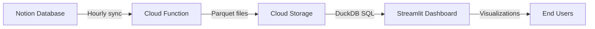

<div align="center">
<h1 align="center">Lakehouse Starter</h1>

  <strong><p align="center">
    A production-ready data lakehouse template using OpenTofu, DLT, and Streamlit on Google Cloud Platform (GCP).</strong>
  </p>

  
</div>

## What Is This?

A complete, ready-to-deploy data lakehouse that combines:

- **Data storage**: Cloud-native storage using GCP Cloud Storage
- **Data ingestion**: Automated pipelines for extracting and loading data
- **Data transformation**: DLT (Data Load Tool) for ELT workflows
- **Data analytics**: DuckDB for high-performance SQL queries against cloud storage
- **Data visualization**: Interactive Streamlit dashboards
- **Infrastructure-as-code**: Everything defined with OpenTofu and Terragrunt

All components are designed to work within GCP's free tier (with typical usage patterns).

## Getting Started

### Prerequisites

- **Accounts & Services**:
  - [Notion account](https://www.notion.so/signup) for data source
  - [Google Cloud billing account](https://cloud.google.com/billing/docs/how-to/create-billing-account) (most resources stay within free tier)

- **CLI Tools**:
  - [gcloud CLI](https://cloud.google.com/sdk/docs/install) with current auth
  - [OpenTofu](https://opentofu.org/docs/intro/install/) for infrastructure
  - [Terragrunt](https://terragrunt.gruntwork.io/docs/getting-started/install/) for infrastructure orchestration

### Quick Start Guide

#### 1. Configure Notion Integration

1. [Create an internal Notion integration](https://developers.notion.com/docs/authorization#internal-integration-auth-flow-set-up)
   - Name your integration (e.g., "Lakehouse Connector")
   - Set read permissions only (no write access needed)

2. [Connect the integration to your database](https://www.notion.so/help/add-and-manage-connections-with-the-api#add-connections-to-pages)
   - Share your database with the integration
   - Copy your integration's secret key for the next steps

#### 2. Configure Local Environment

```shell
# Create your environment configuration from example
cp -a terragrunt/example terragrunt/prod

# Edit configuration files
nano terragrunt/prod/env_vars.yaml
```

Update `env_vars.yaml` with:

- `project_id`: A unique GCP project identifier (create a new one)
- `notion_pipeline.notion_api_key`: Your Notion integration secret
- Optional: Adjust scheduler timing, region, etc.

#### 3. Provision Google Cloud Environment

```shell
# Authenticate with Google Cloud
gcloud auth application-default login

# Set environment variables
export BILLING_ACCOUNT_ID=$(gcloud billing accounts list --format="value(ACCOUNT_ID)" --limit=1)
cd terragrunt/prod
export PROJECT_ID=$(grep "project_id" env_vars.yaml | awk '{print $2}' | tr -d '"')

# Create and configure project
gcloud projects create $PROJECT_ID
gcloud beta billing projects link $PROJECT_ID --billing-account=$BILLING_ACCOUNT_ID

# Enable required APIs
gcloud services enable \
  secretmanager.googleapis.com cloudfunctions.googleapis.com \
  cloudscheduler.googleapis.com \
  run.googleapis.com cloudbuild.googleapis.com \
  artifactregistry.googleapis.com \
  iam.googleapis.com \
  cloudresourcemanager.googleapis.com \
  --project=$PROJECT_ID
```

#### 4. Deploy Infrastructure

```shell
# Deploy all infrastructure components
terragrunt apply
```

#### 5. Access Your Lakehouse

After deployment completes:

```shell
# Get Streamlit webapp URL
echo "Streamlit URL: $(terragrunt output -raw streamlit_service_url)"

# Trigger initial data load
curl -i -X POST $(terragrunt output -raw notion_pipeline_function_uri) \
    -H "Authorization: bearer $(gcloud auth print-identity-token)"
```

## Using Your Lakehouse

### Data Flow Process



### Managing Data Ingestion

**Manual Data Refresh:**

```shell
# Using curl
curl -i -X POST $(terragrunt output -raw notion_pipeline_function_uri) \
    -H "Authorization: bearer $(gcloud auth print-identity-token)"

# Using Cloud Scheduler
gcloud scheduler jobs run $(terragrunt output -raw notion_pipeline_scheduler_name) \
    --project=$PROJECT_ID \
    --location=$(terragrunt output -raw notion_pipeline_scheduler_region)
```

**View Ingestion Logs:**

```shell
# Get function name
FUNCTION_NAME=$(terragrunt output -raw notion_pipeline_function_name)

# View recent logs
gcloud functions logs read $FUNCTION_NAME --project=$PROJECT_ID --limit=50
```

### Running Services Locally

For local development and testing:

- [Streamlit App Development Guide](opentofu/modules/streamlit/README.md)
- [Notion Pipeline Development Guide](opentofu/modules/notion_pipeline/README.md)

## Cost Management

This solution uses GCP's [free tier](https://cloud.google.com/free?hl=en) resources:

| Component | Free Tier Limit | Typical Usage |
|-----------|-----------------|---------------|
| Cloud Storage | 5GB | < 1GB for most use cases |
| Cloud Functions | 2M invocations | ~720 invocations/month (hourly) |
| Cloud Run | 2M requests, 360K GB-seconds | Well below with periodic usage |
| Cloud Scheduler | 3 jobs | 1 job used |

To estimate costs for larger deployments:

```shell
# Install Infracost CLI
brew install infracost  # or equivalent for your OS

# Run cost analysis
infracost breakdown --path terragrunt/prod
```

> Note: Infracost doesn't account for free tier usage. Actual costs will likely be lower.

## Maintenance & Troubleshooting

### Common Issues

- **Data not showing up?** Check Cloud Function logs and verify Notion API connection
- **Streamlit app not loading?** Ensure Cloud Build trigger has completed successfully
- **Permission errors?** Verify service account roles are properly configured

### Updating Components

```shell
# Pull latest code
git pull

# Apply infrastructure changes
terragrunt apply

# Rebuild Streamlit app if needed
gcloud builds triggers run $(terragrunt output -raw streamlit_build_trigger_name) \
    --region=$(terragrunt output -raw streamlit_build_trigger_region)
```

## Cleanup

### Option 1: Remove Individual Resources

```shell
# Preserve state bucket for future use
terragrunt destroy
```

### Option 2: Complete Removal

```shell
# Delete entire project and local state
gcloud projects delete $PROJECT_ID
rm -rf .terraform.lock.hcl .terragrunt-cache
```

## Roadmap

- [ ] Add support for additional data sources (Google Sheets, CSV uploads)
- [ ] Implement basic dbt integration for transformations
- [ ] Create a lightweight version with DLT embedded directly in Streamlit
- [ ] Add authentication options beyond basic auth
- [ ] Develop pre-built dashboard templates for common use cases

## Contributing

We welcome contributions to improve this starter template:

1. Fork the project
2. Create your feature branch (`git checkout -b feature/new-connector`)
3. Commit changes (`git commit -m 'Add new connector for XYZ'`)
4. Push to branch (`git push origin feature/new-connector`)
5. Open a Pull Request with detailed description

## License

Distributed under the MIT License. See `LICENSE` for more information.

## Contact

Tucared - <1v8ufskf@duck.com>

Project Link: [https://github.com/tucared/lakehouse-starter](https://github.com/tucared/lakehouse-starter)
