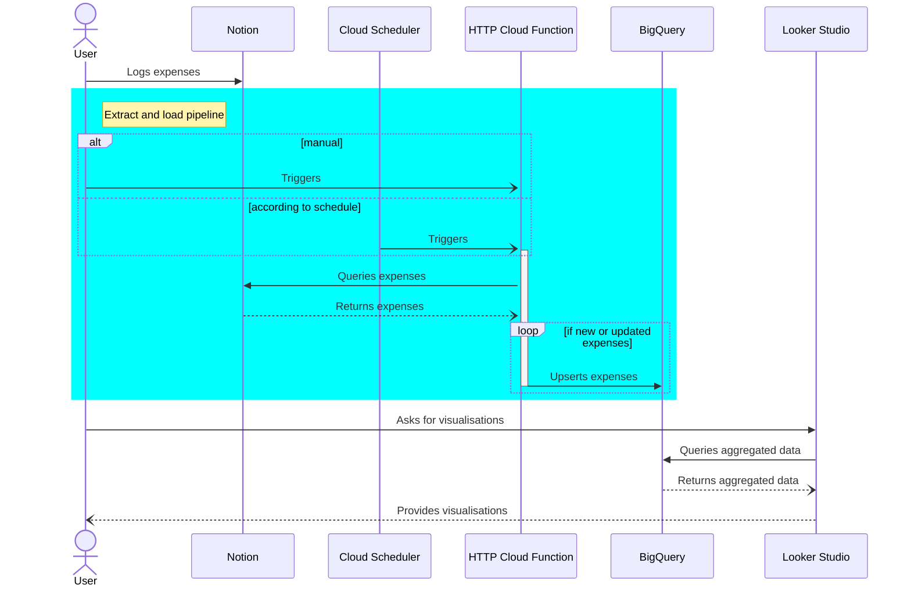

# Notion Budget Tracker

Budget tracker levering [Notion](notion.so) as expense recorder, and Google Cloud Platform free tier for transformation and visualisation (Looker Studio).

> Example [Notion table](https://adjoining-heath-cac.notion.site/3b78e071709e4a28ab16798de93e12c6?v=e8126179c6b64a029d8e20675dc4e48e) to log expenses in, and **[LINK TO ADD]** Looker Studio report to analyse those expenses

## Workflow

- The **User** manually logs each expense as a [Page](https://developers.notion.com/reference/page) in a [Notion database](https://developers.notion.com/reference/database), as it happens
- Either the User, or the **Cloud Scheduler**, calls a private **HTTP Cloud Function** (`notion-to-bigquery`) to extract new and updated Pages from said Notion database, then load (upserts) them into a **BigQuery** native table
- A **Looker Studio** report provides visualisations based on BigQuery views



## Setup

**Prerequisites**:
- [Create a Notion account](https://www.notion.so/signup)
- [Create a Google Cloud Billing account](https://cloud.google.com/billing/docs/how-to/create-billing-account)
- [Install the gcloud CLI](https://cloud.google.com/sdk/docs/install)

To setup this solution as a budget tracker, follow steps below:

1. Create a Google Cloud project, link billing account and enable relevant services
    ```shell
    export PROJECT_ID=notion-budget-tracker
    gcloud projects create $PROJECT_ID
    gcloud config set project $PROJECT_ID

    # Run following command to list billing accounts:
    #      gcloud beta billing accounts list
    export BILLING_ACCOUNT_ID=000000-0AAA00-00AAA0
    gcloud beta billing projects link $PROJECT_ID --billing-account=$BILLING_ACCOUNT_ID

    gcloud services enable secretmanager.googleapis.com
    ```

2. Create a Notion database to record expenses
   - Duplicate this [public template database](https://adjoining-heath-cac.notion.site/ae50475a83bd40edbced0544315364fa?v=d212f11f17c646cc862983622904c8bb) into a Workspace you own
   - Copy database ID from browser URL bar: `https://www.notion.so/{DATABASE_ID}?v={VIEW_ID}`
        ```shell
        export NOTION_DATABASE_ID=replaceByValueInUrl
        ```


3. Create a Notion integration to read data from database
   - Create an internal integration on [Notion Developers](https://www.notion.so/my-integrations), associated with workspace from previous step with `notion-budget-tracker` as name
   - Under the *Capabilities* section, uncheck `Update content` and `Insert content` then click **Save changes**
   - Under the *Secrets* section, copy integration secret and store it locally before uploading it as a secret using Google Secret Manager
        ```shell
        mkdir secrets
        cat > secrets/notion-integration.txt # Paste secret, then save and close using Ctrl+D
        gcloud secrets create NOTION_INTEGRATION_SECRET --data-file="secrets/notion-integration.txt"
        ```


4. Deploy an HTTP Cloud Function, with a dedicated service account and target BigQuery dataset
5. Deploy a Cloud Scheduler to call Cloud Function
6. Define BigQuery views used by Looker Studio report
7. Create a Looker Studio report</b></summary>


## Notes
<details>
<summary><i>Draft documentation</i></summary>


## Setting up tool

### Notion

- Duplicate template page
- Get database ID
- Create API key
- Store key in Google Secret Manager

### Extract and load pipeline

- Create google cloud platform project
- Create service account

**HTTP Cloud Function**

- Create BigQuery dataset and table, and define in env vars
- Deploy and test function locally
- Deploy and test functions remotely

**Cloud Scheduler**

- Create and test a schedule locally ([instructions](https://cloud.google.com/community/tutorials/using-scheduler-invoke-private-functions-oidc))
- Create and test a schedule remotely

### Looker Studio

- Duplicate template report
- Change data source to your own BigQuery

</details>