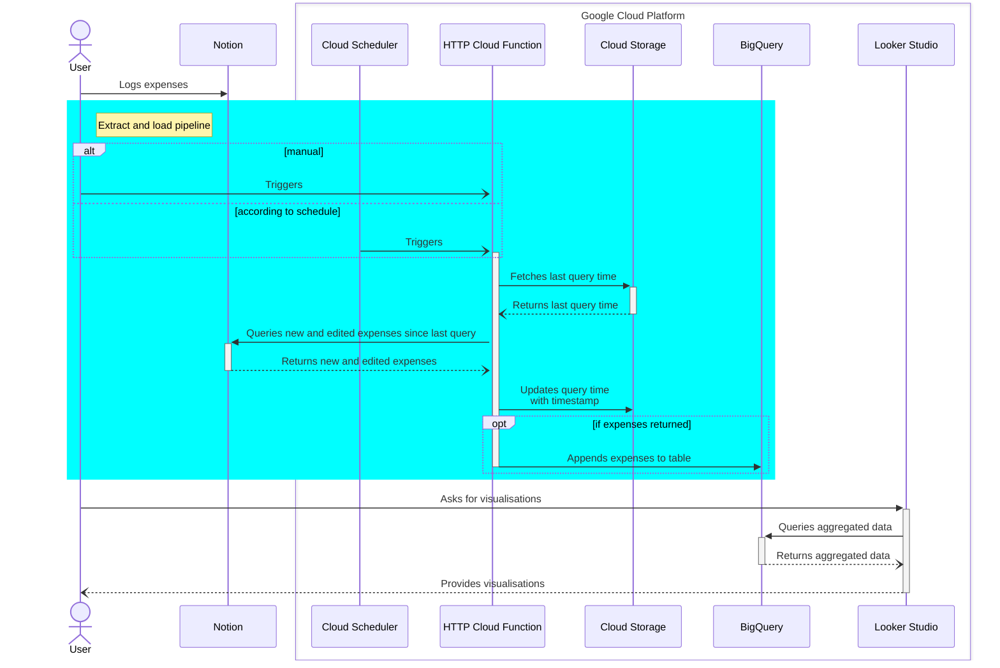

# Notion Budget Tracker

Budget tracker leveraging [Notion](notion.so) as expense recorder, and Google Cloud Platform free tier for transformation and visualisation (Looker Studio).

> Example [Notion table](https://adjoining-heath-cac.notion.site/3b78e071709e4a28ab16798de93e12c6?v=e8126179c6b64a029d8e20675dc4e48e) to log expenses in, and **[LINK TO ADD]** Looker Studio report to analyse those expenses

## Workflow

- The **User** manually logs each expense as a [Page](https://developers.notion.com/reference/page) in a [Notion database](https://developers.notion.com/reference/database), as it happens
- Either the User, or the **Cloud Scheduler**, calls a private **HTTP Cloud Function** (`notion-to-bigquery`) to extract new and updated Pages from said Notion database, then loads them into a **BigQuery** native transactional table
- A **Looker Studio** report provides visualisations based on BigQuery views



## Setup

**Prerequisites**:

- [Create a Notion account](https://www.notion.so/signup)
- [Create a Google Cloud Billing account](https://cloud.google.com/billing/docs/how-to/create-billing-account)
- [Install (with initialisation) the gcloud CLI](https://cloud.google.com/sdk/docs/install)

To setup this solution as a budget tracker, follow steps below:

1. Duplicate `.env.example` file and rename it to `.env`

2. In `.env` file, modify value for `BILLING_ACCOUNT_ID` with one returned by following command:

    ```shell
    gcloud beta billing accounts list
    # ACCOUNT_ID            NAME                OPEN  MASTER_ACCOUNT_ID
    # 000000-000000-000000  My Billing Account  True
    ```

3. Create a Notion database to record expenses

   - Duplicate this [public template database](https://adjoining-heath-cac.notion.site/ae50475a83bd40edbced0544315364fa?v=d212f11f17c646cc862983622904c8bb) into a Workspace you own

   - Open database page in full-screen mode and copy database ID from browser URL bar: `https://www.notion.so/{DATABASE_ID}?v={VIEW_ID}`

   - In `.env` file, modify value for `NOTION_DATABASE_ID` with value in clipboard

4. Load environment variables to shell (to repeat each time you open a terminal)

    ```shell
    source .env
    ```

5. Create a Google Cloud project, link billing account and enable relevant services

    ```shell
    # Create project and assign billing account
    gcloud projects create $PROJECT_ID
    gcloud config set project $PROJECT_ID
    gcloud beta billing projects link $PROJECT_ID --billing-account=$BILLING_ACCOUNT_ID

    # Enable services needed for code execution
    gcloud services enable secretmanager.googleapis.com

    # Enable services needed for Cloud Function deployment
    gcloud services enable cloudfunctions.googleapis.com
    gcloud services enable cloudbuild.googleapis.com
    gcloud services enable artifactregistry.googleapis.com
    gcloud services enable run.googleapis.com
    gcloud services enable logging.googleapis.com
    gcloud services enable pubsub.googleapis.com
    ```

6. Create a Notion integration to read data from database

7. Create an internal integration on [Notion Developers](https://www.notion.so/my-integrations), associated with workspace from previous step with `notion-budget-tracker` as name

    - Under the _Capabilities_ section, uncheck `Update content` and `Insert content` then click **Save changes**

    - Under the _Secrets_ section, copy integration secret and store it locally before uploading it as a secret using Google Secret Manager

        ```shell
        mkdir secrets
        cat > secrets/notion-integration.txt # Paste secret, then save and close using Ctrl+D
        gcloud secrets create $GSM_NOTION_SECRET_NAME --data-file="secrets/notion-integration.txt"
        ```

    - Open database page and _Add connection_ to the integration you created.

8. Create BigQuery dataset where table with Notion data will be stored

    ```shell
    bq --location=$BQ_LOCATION mk --dataset $PROJECT_ID:$BQ_DATASET_ID
    ```

9. Create Cloud Storage bucket to store cloud function status file

    ```shell
    gcloud storage buckets create gs://$BUCKET_NAME
    ```

10. Create a service account and grant necessary permissions

    - Create service account

        ```shell
        gcloud iam service-accounts create $SA_NAME
        ```

    - Grant permissions to access secret values from Google Secret Manager, run jobs in BigQuery and edits objects in relevant Cloud Storage bucket

        ```shell
        gcloud beta secrets add-iam-policy-binding $GSM_NOTION_SECRET_NAME \
            --member serviceAccount:$SA_NAME@$PROJECT_ID.iam.gserviceaccount.com \
            --role roles/secretmanager.secretAccessor

        gcloud projects add-iam-policy-binding $PROJECT_ID \
            --member serviceAccount:$SA_NAME@$PROJECT_ID.iam.gserviceaccount.com \
            --role roles/bigquery.jobUser

        gcloud storage buckets add-iam-policy-binding gs://$BUCKET_NAME \
            --member serviceAccount:$SA_NAME@$PROJECT_ID.iam.gserviceaccount.com \
            --role roles/storage.objectUser
        ```

    - Grant read and write access to destination dataset

      - Get current permissions into file

        ```shell
        mkdir iam
        bq show --format=prettyjson $PROJECT_ID:$BQ_DATASET_ID > iam/$BQ_DATASET_ID.json
        ```

      - Open file under `iam` folder and update `access` object to add read and write access

        ```json
        {
            "access": [
                    // ...,
                    {
                        "role": "WRITER",
                        "userByEmail": "notion-to-bq-cloud-fnc@notion-budget-tracker.iam.gserviceaccount.com"
                    },
                    {
                        "role": "READER",
                        "userByEmail": "notion-to-bq-cloud-fnc@notion-budget-tracker.iam.gserviceaccount.com"
                    }
                ]
                    // ...
        }
        ```

      - Save changes to file and update permission

        ```shell
        bq update --source iam/$BQ_DATASET_ID.json $PROJECT_ID:$BQ_DATASET_ID
        ```

11. _(Optional)_ [Run HTTP Cloud Function locally](##locally-invoke-cloud-function-using-functions-framework) once to initialise table

12. Deploy the HTTP Cloud Function ([details about flags used](https://cloud.google.com/functions/docs/create-deploy-gcloud#deploying_the_function)), and invoke it to test deployment

    ```shell
    gcloud functions deploy $CF_FUNCTION_NAME \
        --gen2 \
        --runtime=$CF_RUNTIME \
        --service-account=$SA_NAME@$PROJECT_ID.iam.gserviceaccount.com \
        --region=$CF_REGION \
        --source=$CF_SOURCE \
        --entry-point=$CF_ENTRYPOINT \
        --trigger-http \
        --set-env-vars PROJECT_ID=$PROJECT_ID \
        --set-env-vars BQ_TABLE_ID=$BQ_TABLE_ID \
        --set-env-vars NOTION_DATABASE_ID=$NOTION_DATABASE_ID \
        --set-env-vars GSM_NOTION_SECRET_NAME=$GSM_NOTION_SECRET_NAME \
        --set-env-vars BUCKET_NAME=$BUCKET_NAME \
        --set-env-vars DESTINATION_BLOB_NAME_STATE_FILE=$DESTINATION_BLOB_NAME_STATE_FILE

    # Invoke deployed function
    curl -i -X POST https://$CF_REGION-$PROJECT_ID.cloudfunctions.net/$CF_FUNCTION_NAME \
        -H "Authorization: bearer $(gcloud auth print-identity-token)" \
        -H "Content-Type: application/json" \
        -d '{}'

    # Delete function
    gcloud functions delete $CF_FUNCTION_NAME --gen2 --region $CF_REGION

    # Delete BigQuery table and state file
    bq rm -f -t $PROJECT_ID:$BQ_DATASET_ID.$BQ_TABLE_NAME
    gcloud storage rm gs://$BUCKET_NAME/$DESTINATION_BLOB_NAME_STATE_FILE
    ```

13. **[TODO]** Deploy a Cloud Scheduler to call deployed HTTP Cloud Function

    - Create and test a schedule locally ([instructions](https://cloud.google.com/community/tutorials/using-scheduler-invoke-private-functions-oidc))

    - Create and test a schedule remotely

14. **[TODO]** Define BigQuery views used by Looker Studio report

15. **[TODO]** Create a Looker Studio report

    - Duplicate template report

    - Change data source to your own BigQuery

## Locally invoke Cloud function, using `functions-framework`

**Prerequisites**:

- Download service account key file

    ```shell
    gcloud iam service-accounts keys create $CF_FOLDER_PATH/$CF_GOOGLE_APPLICATION_CREDENTIALS_PATH \
        --iam-account=$SA_NAME@$PROJECT_ID.iam.gserviceaccount.com
    ```

- [Create a virtual environment and] install `functions-framework`

    ```shell
    pip install functions-framework
    ```

**Steps**:

1. Start local server  

    ```shell
    export GOOGLE_APPLICATION_CREDENTIALS=secrets/sa-private-key.json
    export BQ_TABLE_ID=$PROJECT_ID.$BQ_DATASET_ID.raw_notion_pages__duplicated__TEST
    export DESTINATION_BLOB_NAME_STATE_FILE=last_update_time__TEST.txt
    functions-framework \
    --target=$CF_ENTRYPOINT \
    --source=$CF_SOURCE/main.py \
    --debug
    ```

2. Open another shell, and invoke function

    ```shell
    curl localhost:8080
    ```

3. _(Optional)_ Delete BigQuery table and state file

    ```shell
    bq rm -f -t $PROJECT_ID:$BQ_DATASET_ID.raw_notion_pages__duplicated__TEST
    gcloud storage rm gs://$BUCKET_NAME/last_update_time__TEST.txt
    ```
