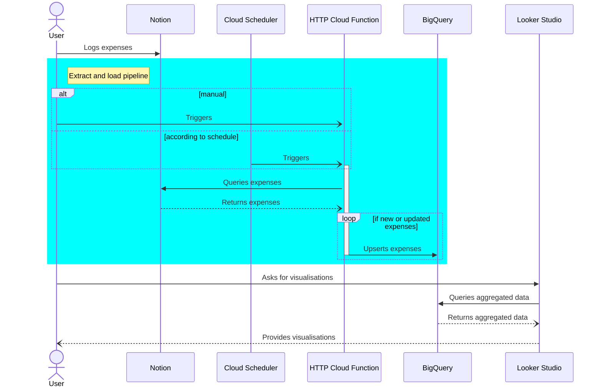

# Notion Budget Tracker

Budget tracker levering [Notion](notion.so) as expense recorder, and Google Cloud Platform for transformation and visualisation.

- The **User** manually logs each expense as a [Page](https://developers.notion.com/reference/page) in a [Notion database](https://developers.notion.com/reference/database), as it happens
- Either the User, or the **Cloud Scheduler**, calls a private **HTTP Cloud Function** (`notion-to-bigquery`) to extract new and updated Pages from said Notion database, then load (upserts) them into a **BigQuery** native table
- A **Looker Studio** report provides visualisations based on BigQuery views

Draft documentation

## Example project 

- Add Notion example database
- Add Looker Studio example report

## Setting up tool

### Notion

- Duplicate template page
- Get database ID
- Create API key
- Store key in Google Secret Manager

### Extract and load pipeline

- Create google cloud platform project
- Create service account

**HTTP Cloud Function**

- Create BigQuery dataset and table, and define in env vars
- Deploy and test function locally
- Deploy and test functions remotely

**Cloud Scheduler**

- Create and test a schedule locally ([instructions](https://cloud.google.com/community/tutorials/using-scheduler-invoke-private-functions-oidc))
- Create and test a schedule remotely

### Looker Studio

- Duplicate template report
- Change data source to your own BigQuery

