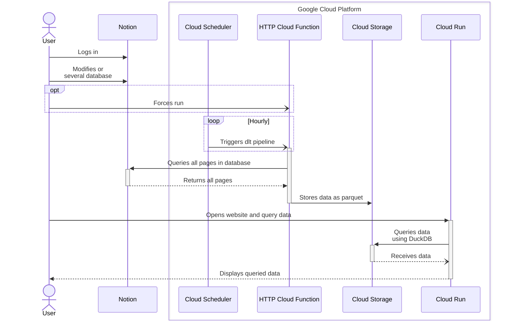

<div align="center">
<h1 align="center">Lakehouse Starter</h1>

  <strong><p align="center">
    A production-ready data lakehouse template using OpenTofu, DLT, and Streamlit on Google Cloud Platform (GCP).</strong>
  </p>

  
</div>

## Overview

This project provides a template for building a modern data lakehouse that:

- Deploys infrastructure-as-code using OpenTofu on GCP
- Includes a modular data pipeline powered by DLT (starting with Notion integration)
- Enables SQL analytics using DuckDB for efficient data querying
- Features a Streamlit web application for interactive data exploration
- Stays within GCP's free tier limits when used as provided

<!-- GETTING STARTED -->
## Getting Started

To get a copy of the project up and running follow the steps below.

### Prerequisites

- [Notion account]
- [Google Cloud billing account]
- [gcloud CLI] installed
- [OpenTofu] installed
- [Terragrunt] installed

### Installation Steps

#### Setup Notion Database

- [Create an internal Notion integration] with read permissions

- [Connect the integration to your database]

#### Configure Local Repository

```shell
cp -a terragrunt/example terragrunt/prod
```

Edit `terragrunt/prod/env_vars.yaml` with your:

- project_id (unique GCP identifier)
- notion_secret_value

#### Setup Google Cloud Project

```shell
export BILLING_ACCOUNT_ID=your_billing_account_id
cd terragrunt/prod
export PROJECT_ID=$(grep "project_id" env_vars.yaml | awk '{print $2}' | tr -d '"')

gcloud projects create $PROJECT_ID
gcloud beta billing projects link $PROJECT_ID --billing-account=$BILLING_ACCOUNT_ID

# Enable required APIs
gcloud services enable secretmanager.googleapis.com --project=$PROJECT_ID
gcloud services enable cloudfunctions.googleapis.com --project=$PROJECT_ID
gcloud services enable cloudscheduler.googleapis.com --project=$PROJECT_ID
gcloud services enable run.googleapis.com --project=$PROJECT_ID
gcloud services enable cloudbuild.googleapis.com --project=$PROJECT_ID
gcloud services enable artifactregistry.googleapis.com --project=$PROJECT_ID
gcloud services enable iam.googleapis.com --project=$PROJECT_ID
gcloud services enable cloudresourcemanager.googleapis.com --project=$PROJECT_ID
```

#### Configure Service Account

```shell
unset GOOGLE_CREDENTIALS
gcloud auth application-default login --no-launch-browser
```

Then create and configure the service account using the provided script below.

<details><summary>Script to create service account and assign permissions</summary>

```shell
export PROJECT_ID=$(grep "project_id" env_vars.yaml | awk '{print $2}' | tr -d '"')
export TOFU_SERVICE_ACCOUNT=$(grep "sa_tofu" env_vars.yaml | awk '{print $2}' | tr -d '"')
export USER_ACCOUNT_ID=$(echo `gcloud config get core/account`)

gcloud iam service-accounts create $TOFU_SERVICE_ACCOUNT \
    --display-name "OpenTofu SA" \
    --description "Used when running OpenTofu commands" \
    --project $PROJECT_ID

gcloud projects add-iam-policy-binding $PROJECT_ID \
    --member "serviceAccount:$TOFU_SERVICE_ACCOUNT@$PROJECT_ID.iam.gserviceaccount.com" \
    --project $PROJECT_ID \
    --role "roles/editor"

gcloud projects add-iam-policy-binding $PROJECT_ID \
    --member "serviceAccount:$TOFU_SERVICE_ACCOUNT@$PROJECT_ID.iam.gserviceaccount.com" \
    --project $PROJECT_ID \
    --role "roles/secretmanager.admin"

gcloud projects add-iam-policy-binding $PROJECT_ID \
    --member "serviceAccount:$TOFU_SERVICE_ACCOUNT@$PROJECT_ID.iam.gserviceaccount.com" \
    --project $PROJECT_ID \
    --role "roles/bigquery.dataEditor"

gcloud projects add-iam-policy-binding $PROJECT_ID \
    --member "serviceAccount:$TOFU_SERVICE_ACCOUNT@$PROJECT_ID.iam.gserviceaccount.com" \
    --project $PROJECT_ID \
    --role "roles/iam.serviceAccountCreator"

gcloud projects add-iam-policy-binding $PROJECT_ID \
    --member "serviceAccount:$TOFU_SERVICE_ACCOUNT@$PROJECT_ID.iam.gserviceaccount.com" \
    --project $PROJECT_ID \
    --role "roles/resourcemanager.projectIamAdmin"

gcloud projects add-iam-policy-binding $PROJECT_ID \
    --member "serviceAccount:$TOFU_SERVICE_ACCOUNT@$PROJECT_ID.iam.gserviceaccount.com" \
    --project $PROJECT_ID \
    --role "roles/cloudfunctions.admin"

gcloud projects add-iam-policy-binding $PROJECT_ID \
    --member "serviceAccount:$TOFU_SERVICE_ACCOUNT@$PROJECT_ID.iam.gserviceaccount.com" \
    --project $PROJECT_ID \
    --role "roles/cloudscheduler.admin"

gcloud projects add-iam-policy-binding $PROJECT_ID \
    --member "serviceAccount:$TOFU_SERVICE_ACCOUNT@$PROJECT_ID.iam.gserviceaccount.com" \
    --project $PROJECT_ID \
    --role "roles/run.admin"

gcloud iam service-accounts add-iam-policy-binding \
    $TOFU_SERVICE_ACCOUNT@$PROJECT_ID.iam.gserviceaccount.com \
    --project $PROJECT_ID \
    --member "user:$USER_ACCOUNT_ID" \
    --role "roles/iam.serviceAccountTokenCreator"
```

</details>

#### Deploy Infrastructure

```shell
terragrunt apply

# Deploy Streamlit app
gcloud builds triggers run $(terragrunt output streamlit_build_trigger_name | sed 's/"//g') \
    --region=$(terragrunt output streamlit_build_trigger_region | sed 's/"//g')
```

## Usage

### Data Flow

1. **Source**: Data stored in Notion databases
2. **Ingestion**: Automated via Cloud Scheduler or manual triggers
3. **Storage**: Data stored in Cloud Storage
4. **Analysis**: Access via Streamlit webapp using DuckDB

<details><summary>Sequence diagram</summary>



</details>

### Triggering Data Ingestion

Manual trigger:

```shell
curl -i -X POST $(terragrunt output notion_pipeline_function_uri | sed 's/"//g') \
    -H "Authorization: bearer $(gcloud auth print-identity-token)"
```

Force scheduler run:

```shell
gcloud scheduler jobs run $(terragrunt output notion_pipeline_scheduler_dlt_name | sed 's/"//g') \
    --project=$(grep "project_id" env_vars.yaml | awk '{print $2}' | tr -d '"') \
    --location=$(terragrunt output notion_pipeline_scheduler_dlt_region | sed 's/"//g')
```

### Cleanup

Option 1 - Remove resources except state bucket:

```shell
terragrunt destroy
```

Option 2 - Delete entire project:

```shell
gcloud projects delete $PROJECT_ID
rm -rf .terraform.lock.hcl .terragrunt-cache
```

## Cost Management

This project stays within GCP's free tier when:

- It's your only active GCP project
- Notion databases are moderate in size (~few thousands rows without images)

Use [Infracost] to estimate costs ([free tier ignored]):

```shell
infracost breakdown --path terragrunt/example
```

## Roadmap

- [ ] Transform the DLT notion pipeline and Streamlit app into OpenTofu modules
- [ ] Create a branch for embedding DLT to Streamlit (removing need for Cloud Storage)

## Contributing

1. Fork the project
2. Create your feature branch (`git checkout -b feature/AmazingFeature`)
3. Commit changes (`git commit -m 'Add AmazingFeature'`)
4. Push to branch (`git push origin feature/AmazingFeature)`
5. Open a Pull Request

## License

Distributed under the MIT License. See `LICENSE` for more information.

## Contact

Tucared - <1v8ufskf@duck.com>

<!-- MARKDOWN LINKS & IMAGES -->
<!-- https://www.markdownguide.org/basic-syntax/#reference-style-links -->
[Notion account]: https://www.notion.so/signup
[Google Cloud billing account]: https://cloud.google.com/billing/docs/how-to/create-billing-account
[gcloud CLI]: https://cloud.google.com/sdk/docs/install
[OpenTofu]: https://opentofu.org/docs/intro/install/
[Terragrunt]: https://terragrunt.gruntwork.io/docs/getting-started/install/

[Create an internal Notion integration]: https://developers.notion.com/docs/authorization#internal-integration-auth-flow-set-up
[Connect the integration to your database]: https://www.notion.so/help/add-and-manage-connections-with-the-api#add-connections-to-pages

[Infracost]: https://github.com/infracost/infracost/tree/master

[free tier ignored]: https://www.infracost.io/docs/supported_resources/google/
