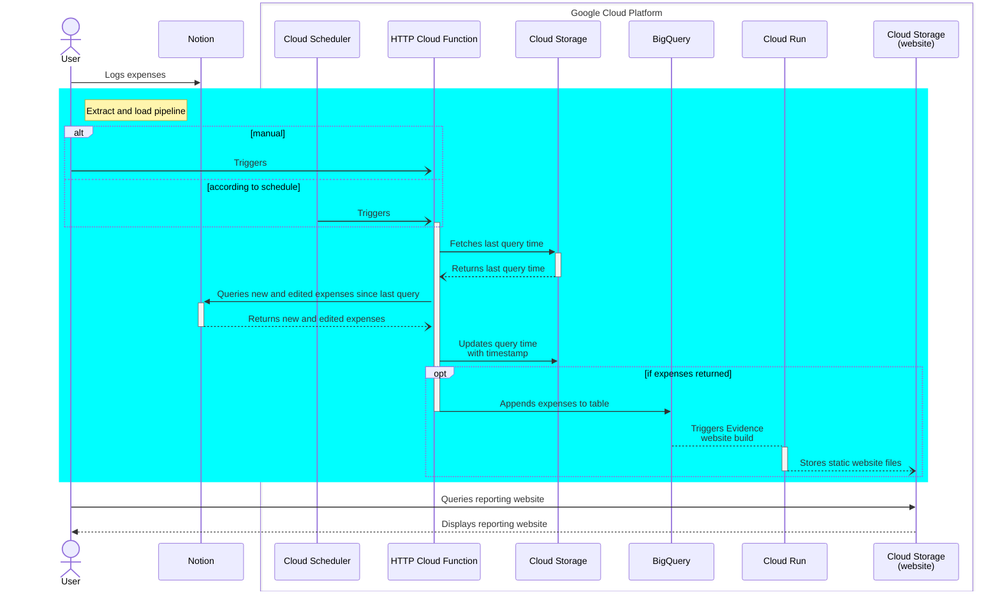

<!-- Improved compatibility of back to top link: See: https://github.com/othneildrew/Best-README-Template/pull/73 -->
<a name="readme-top"></a>

<!-- PROJECT LOGO -->
<br />
<div align="center">
  <!-- <a href="https://github.com/tucared/notion-budget-tracker">
    
  </a> -->

<h1 align="center">Notion Budget Tracker</h1>

  <strong><p align="center">
    Free expense tracker with customisable categories, and authentified reporting static website</strong>
    <br />
    <a href="https://www.notion.so/3b78e071709e4a28ab16798de93e12c6?v=e8126179c6b64a029d8e20675dc4e48e">View expense logger demo</a>
    ·
    <a href="https://github.com/tucared/notion-budget-tracker">[TODO] View reporting website demo</a>
  </p>
</div>

<!-- TABLE OF CONTENTS -->
<details>
  <summary>Table of Contents</summary>
  <ol>
    <li>
      <a href="#about-the-project">About The Project</a>
      <ul>
        <li><a href="#built-with">Built With</a></li>
      </ul>
    </li>
    <li>
      <a href="#getting-started">Getting Started</a>
      <ul>
        <li><a href="#prerequisites">Prerequisites</a></li>
        <li><a href="#installation">Installation</a></li>
        <li><a href="#clean-up">Clean-up</a></li>
      </ul>
    </li>
    <li>
        <a href="#usage">Usage</a>
        <ul>
            <li><a href="#invoking-function">Invoking function</a></li>
            <li><a href="#sequence-diagram">Sequence diagram</a></li>
        </ul>
    </li>
    <li><a href="#roadmap">Roadmap</a></li>
    <li>
        <a href="#local-development">Local development</a>
        <ul>
            <li><a href="#run-function-locally">Run function locally</a></li>
            <li><a href="#cost-insights-using-infracost">Cost insights using Infracost</a></li>
        </ul>
    </li>
    <li><a href="#contributing">Contributing</a></li>
    <li><a href="#license">License</a></li>
    <li><a href="#contact">Contact</a></li>
  </ol>
</details>

<!-- ABOUT THE PROJECT -->
## About The Project

This project aims at providing individuals and groups with a lightweight solution to record expenses with fully customisable metadata in a consolidated manner. The main requirements for the project were:

- Reduce user friction regarding transactions data collection.
- Integrate with a wide variety of banks, regardless of digitalisation or regulatory frameworks.
- Be conscious of data privacy and of data security.
- Allow for expense metadata fields customisation, initially aimed at categories.
- Be free, or extremely low price.

<p align="right">(<a href="#readme-top">back to top</a>)</p>

### Built With

- **OpenTofu** (TODO: Add badge on [Badges4-README.md-Profile](https://github.com/alexandresanlim/Badges4-README.md-Profile))
- [![Python][Python.org]][Python-url]
- [![Notion][Notion.so]][Notion-url] _(free tier)_
- [![Google Cloud][Console.cloud.google.com]][Google-Cloud-url] _(free tier)_

<p align="right">(<a href="#readme-top">back to top</a>)</p>

<!-- GETTING STARTED -->
## Getting Started

To get a copy of the project up and running follow the following example steps.

### Prerequisites

- A [Notion account](https://www.notion.so/signup)
- A [Google Cloud Billing account](https://cloud.google.com/billing/docs/how-to/create-billing-account)
- Have [gcloud CLI](https://cloud.google.com/sdk/docs/install) installed
- Have [OpenTofu](https://github.com/opentofu/opentofu/releases) installed

### Installation

1. Duplicate this [Notion public template database](https://adjoining-heath-cac.notion.site/ae50475a83bd40edbced0544315364fa?v=d212f11f17c646cc862983622904c8bb) into a Workspace you own

2. [Setup an internal Notion integration](https://developers.notion.com/docs/authorization#internal-integration-auth-flow-set-up) with only **Read content** capability, and [add it as a connection](https://www.notion.so/help/add-and-manage-connections-with-the-api#add-connections-to-pages) to your database

3. Duplicate `example.tfvars` file into a `terraform.tfvars` one, and modify variables without defaults defined:
   - **notion_database_id**: The globally unique identifier for the Notion database created step 1. [How to retrieve a database ID](https://developers.notion.com/reference/retrieve-a-database)
   - **notion_secret_value**: The unique internal integration token for the Notion integration created step 2. [How to retrieve an integration token](https://developers.notion.com/reference/retrieve-a-database)
   - **project_id**: A globally unique identifier for your project. [How to pick a project ID](https://cloud.google.com/resource-manager/docs/creating-managing-projects#before_you_begin)

4. Initialise OpenTofu

    ```shell
    tofu init
    ```

5. Create Google project and link a billing account to it

    ```shell
    # Load PROJECT_ID value from `terraform.tfvars` file
    export PROJECT_ID=$(echo var.project_id | tofu console | sed 's/"//g')

    # Create project
    gcloud projects create $PROJECT_ID

    # Set BILLING_ACCOUNT_ID
    gcloud beta billing accounts list
    export BILLING_ACCOUNT_ID=<ACCOUNT_ID from previous command>

    # Link billing account to project
    gcloud beta billing projects link $PROJECT_ID --billing-account=$BILLING_ACCOUNT_ID

    # Enable relevant APIs
    gcloud services enable secretmanager.googleapis.com --project=$PROJECT_ID
    gcloud services enable cloudfunctions.googleapis.com --project=$PROJECT_ID
    gcloud services enable cloudscheduler.googleapis.com --project=$PROJECT_ID
    gcloud services enable run.googleapis.com --project=$PROJECT_ID
    gcloud services enable cloudbuild.googleapis.com --project=$PROJECT_ID
    gcloud services enable artifactregistry.googleapis.com --project=$PROJECT_ID
    gcloud services enable logging.googleapis.com --project=$PROJECT_ID
    ```

6. Deploy infrastructure on Google Cloud

    ```shell
    tofu apply
    # Enter a value: yes
    ```

7. Add role `run.invoker` to service account linked to Cloud Scheduler to complete deployment (hashicorp/terraform issue [#15264](https://github.com/hashicorp/terraform-provider-google/issues/15264))

    ```shell
    gcloud functions add-invoker-policy-binding $(tofu output function_name | sed 's/"//g') \
        --project=$PROJECT_ID \
        --region=$(tofu output function_region | sed 's/"//g') \
        --member serviceAccount:$(tofu output sa_email_cloud_scheduler | sed 's/"//g')
    ```

8. _(Optional, recommended)_ Save state file to a remote backend
    <details><summary><strong>Steps</strong></summary>

    1. Create a `backend.tf` file, and update contents as followed

        ```terraform
        terraform {
            backend "gcs" {
              bucket = "<output from shell command 'tofu output bucket_tfstate'>"
              prefix = "terraform/state"
            }
        }
        ```

    2. Migrate state file to remote backend

        ```shell
        tofu init
        # Enter a value: yes
        ```

    3. _(Optional)_ Remove leftover local state files

        ```shell
        rm -rf terraform.tfstate
        rm -rf terraform.tfstate.backup
        ```

    </details>

### Clean-up

You have 2 options for cleaning up deployment:

- Remove all provisionned resources, except for the bucket containing eventual remote state file

    ```shell
    tofu destroy
    # Enter a value: yes
    ```

- Delete project, terraform resources, and eventual `backend.tf` file if remote state was used

    ```shell
    gcloud projects delete $PROJECT_ID
    # Do you want to continue (Y/n)?: Y

    rm -rf backend.tf
    ```

<p align="right">(<a href="#readme-top">back to top</a>)</p>

<!-- USAGE EXAMPLES -->
## Usage

- The **User** manually logs each expense as a [Page](https://developers.notion.com/reference/page) in a [Notion database](https://developers.notion.com/reference/database) with some metadata.
- Either the User, or the **Cloud Scheduler**, calls a private **HTTP Cloud Function** to extract new and updated Pages from said Notion database, then loads them into a **BigQuery** native table.
- **TODO**: An **[Evidence](https://evidence.dev/)** IAM-protected static website providing visualisations is built each time BigQuery table data is updated.

### Invoking function

Once deployed, to trigger the function, you can either invoke it directly or the scheduler that invokes it:

```shell
# Calling function directly
curl -i -X POST $(tofu output function_uri | sed 's/"//g') \
    -H "Authorization: bearer $(gcloud auth print-identity-token)"

# Calling scheduler
gcloud scheduler jobs run $(tofu output scheduler_name | sed 's/"//g') \
    --project=$PROJECT_ID \
    --location=$(tofu output scheduler_region | sed 's/"//g')
```

<details><summary>Checking affected resources' logs</summary>

You verify function execution by looking at its logs:

```shell
gcloud functions logs read $(tofu output function_name | sed 's/"//g') \
    --project=$PROJECT_ID \
    --region=$(tofu output function_region | sed 's/"//g')
```

You can also look at recent modifications from destination table:

```shell
bq show $(tofu output bq_table_id_colon | sed 's/"//g')
# or
bq query --use_legacy_sql=false \
    "SELECT
        id,
        url,
        created_time,
        last_edited_time
    FROM
        \`$(tofu output bq_table_id | sed 's/"//g')\`
    ORDER BY last_edited_time DESC
    LIMIT 5;"
```

</details>

### Sequence diagram



<p align="right">(<a href="#readme-top">back to top</a>)</p>

<!-- ROADMAP -->
## Roadmap

- [ ] Add OpenTofu tests and validations
- [ ] Fix systematic redeployment of cloud function
- [ ] Add visualisation using [Evidence](https://evidence.dev/)
- [ ] Cloud Function
  - [ ] Add option to perform full table refresh
  - [ ] Move database id and destination table to execution variable
- [ ] Add [SimpleFIN Bridge](https://beta-bridge.simplefin.org/) for automated transaction collection
- [ ] Add budgeting feature (target versus actual)

<p align="right">(<a href="#readme-top">back to top</a>)</p>

<!-- HOW TO DEVELOP LOCALLY -->
## Local development

### Run function locally

Though you can deploy a new version of the Cloud Function and invoke it, it remains faster to test it locally using [`functions-framework`](https://github.com/GoogleCloudPlatform/functions-framework-python) with all other cloud services deployed in a **development** infrastructure.

Follow steps below to create another infrastructure and running function locally:

1. Duplicate your production `terraform.tfvars` to a `dev.tfvars`.

   1. Set `cloud_scheduler_parameters.count` value to 0. This prevents Cloud Scheduler from triggering the _deployed_ function

   2. Pick another project ID to deploy your **development** infrastructure

2. If you use a remote backend in production, comment all contents from the `backend.tf` file.

3. Initialise OpenTofu.

    ```shell
    tofu init
    ```

4. Create Google Cloud project the same way that step 5 from [Installation](#installation) while changing first command to:

    ```shell
    export PROJECT_ID=$(echo var.project_id | tofu console -var-file=dev.tfvars | sed 's/"//g')
    ```

5. Deploy infrastructure on Google Cloud

    ```shell
    tofu apply -var-file=dev.tfvars
    # Enter a value: yes
    ```

6. Download service account key file

    ```shell
    export GOOGLE_APPLICATION_CREDENTIALS=secrets/sa-private-key.json
    gcloud iam service-accounts keys create $GOOGLE_APPLICATION_CREDENTIALS \
        --iam-account=$(tofu output sa_email_cloud_function | sed 's/"//g')
    ```

7. [Create a virtual environment and] install dependencies

    ```shell
    export SOURCE=$(echo var.cloud_function_parameters.source | tofu console | sed 's/"//g')
    pip install -r $SOURCE/requirements.txt
    pip install -r $SOURCE/requirements.local.txt
    ```

8. Start local server  

    ```shell
    export BQ_TABLE_ID=$(tofu output bq_table_id | sed 's/"//g')
    export DESTINATION_BLOB_NAME_STATE_FILE=$(echo var.destination_state_file | tofu console | sed 's/"//g')
    export ENTRYPOINT=$(echo var.cloud_function_parameters.entrypoint | tofu console | sed 's/"//g')
    export NOTION_DATABASE_ID=$(echo var.notion_database_id | tofu console | sed 's/"//g')
    export GSM_NOTION_SECRET_NAME=$(echo var.gsm_notion_secret_name | tofu console | sed 's/"//g')
    export BUCKET_NAME=$(echo var.bucket_name | tofu console | sed 's/"//g')
    functions-framework \
        --target=$ENTRYPOINT \
        --source=$SOURCE/main.py \
        --debug
    ```

9. Open another shell, and invoke function

    ```shell
    curl localhost:8080
    ```

10. Destroy deployment (or delete project) and revert back to **production** environment by:

    - Destroying deployment and local state files

        ```shell
        tofu destroy # or: gcloud projects delete $PROJECT_ID
        rm -rf terraform.tfstate
        rm -rf terraform.tfstate.backup
        ```

    - Eventually uncomment contents from the `backend.tf` file
  
    - Initialise `tofu` with remote backend

        ```shell
        tofu init
        ```

### Cost insights using [Infracost](https://github.com/infracost/infracost/tree/master)

As mentionned earlier, **deploying this solution costs nothing as it leverages Google Cloud Free Tier**.

However, a Infracost usage file (`infracost-usage.yml`) was created based on default deployment variables and typical workload. You will see a non-zero estimated cost using Infracost as it [specifies](https://www.infracost.io/docs/supported_resources/google/):
> Free trials and free tiers, which are usually **not** a significant part of cloud costs, are ignored.

After [installing Infracost](https://www.infracost.io/docs/), run following command to diplay estimated cloud costs:

```shell
infracost breakdown --path=. \
    --usage-file=infracost-usage.yml \
    --terraform-var-file=terraform.tfvars
```

<p align="right">(<a href="#readme-top">back to top</a>)</p>

<!-- CONTRIBUTING -->
## Contributing

Contributions are what make the open source community such an amazing place to learn, inspire, and create. Any contributions you make are **greatly appreciated**.

If you have a suggestion that would make this better, please fork the repo and create a pull request. You can also simply open an issue with the tag "enhancement".
Don't forget to give the project a star! Thanks again!

1. Fork the Project
2. Create your Feature Branch (`git checkout -b feature/AmazingFeature`)
3. Commit your Changes (`git commit -m 'Add some AmazingFeature'`)
4. Push to the Branch (`git push origin feature/AmazingFeature`)
5. Open a Pull Request

<p align="right">(<a href="#readme-top">back to top</a>)</p>

<!-- LICENSE -->
## License

Distributed under the MIT License. See `LICENSE` for more information.

<p align="right">(<a href="#readme-top">back to top</a>)</p>

<!-- CONTACT -->
## Contact

Tucared - <1v8ufskf@duck.com>

<p align="right">(<a href="#readme-top">back to top</a>)</p>

<!-- MARKDOWN LINKS & IMAGES -->
<!-- https://www.markdownguide.org/basic-syntax/#reference-style-links -->
[Python.org]: https://img.shields.io/badge/Python-FFD43B?style=for-the-badge&logo=python&logoColor=blue
[Python-url]: https://www.python.org/
[Notion.so]: https://img.shields.io/badge/Notion-000000?style=for-the-badge&logo=notion&logoColor=white
[Notion-url]: https://www.notion.so/
[Console.cloud.google.com]: https://img.shields.io/badge/Google_Cloud-4285F4?style=for-the-badge&logo=google-cloud&logoColor=white
[Google-Cloud-url]: https://console.cloud.google.com
