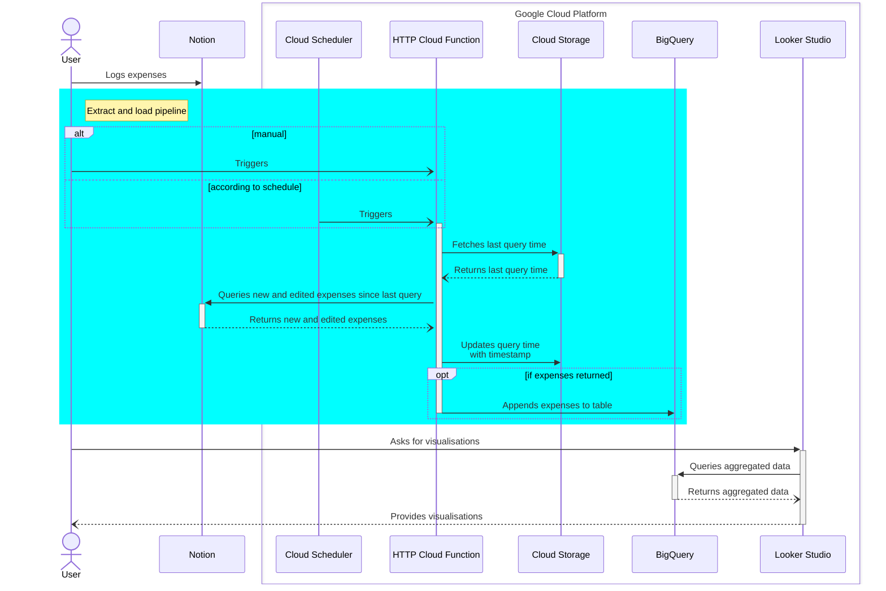

<!-- Improved compatibility of back to top link: See: https://github.com/othneildrew/Best-README-Template/pull/73 -->
<a name="readme-top"></a>

<!-- PROJECT LOGO -->
<br />
<div align="center">
  <!-- <a href="https://github.com/tucared/notion-budget-tracker">
    
  </a> -->

<h1 align="center">Notion Budget Tracker</h1>

  <strong><p align="center">
    Free expense tracker with customisable categories, aggregated calculations and hourly updated dashboard</strong>
    <br />
    <a href="https://www.notion.so/3b78e071709e4a28ab16798de93e12c6?v=e8126179c6b64a029d8e20675dc4e48e">View expense logger demo</a>
    ·
    <a href="https://github.com/tucared/notion-budget-tracker">[TODO] View dashboard demo</a>
  </p>
</div>

<!-- TABLE OF CONTENTS -->
<details>
  <summary>Table of Contents</summary>
  <ol>
    <li>
      <a href="#about-the-project">About The Project</a>
      <ul>
        <li><a href="#built-with">Built With</a></li>
      </ul>
    </li>
    <li>
      <a href="#getting-started">Getting Started</a>
      <ul>
        <li><a href="#prerequisites">Prerequisites</a></li>
        <li><a href="#installation">Installation</a></li>
      </ul>
    </li>
    <li><a href="#usage">Usage</a></li>
    <li><a href="#roadmap">Roadmap</a></li>
    <li><a href="#contributing">Contributing</a></li>
    <li><a href="#license">License</a></li>
    <li><a href="#contact">Contact</a></li>
  </ol>
</details>

<!-- ABOUT THE PROJECT -->
## About The Project

This project aims at providing individuals and groups with a lightweight solution to record expenses with fully customisable metadata in a consolidated manner. The main requirements for the project were:

- Reduce user friction regarding transactions data collection.
- Integrate with a wide variety of banks, regardless of digitalisation or regulatory frameworks.
- Be conscious of data privacy and of data security.
- Allow for expense metadata fields customisation, initially aimed at categories.
- Be free, or extremely low price.

<p align="right">(<a href="#readme-top">back to top</a>)</p>

### Built With

- [![Python][Python.org]][Python-url]
- [![Notion][Notion.so]][Notion-url] _(free tier)_
- [![Google Cloud][Console.cloud.google.com]][Google-Cloud-url] _(free tier)_

<p align="right">(<a href="#readme-top">back to top</a>)</p>

<!-- GETTING STARTED -->
## Getting Started

To get a copy of the project up and running follow the following example steps.

### Prerequisites

- [Create a Notion account](https://www.notion.so/signup)
- [Create a Google Cloud Billing account](https://cloud.google.com/billing/docs/how-to/create-billing-account)
- [Install (with initialisation) the gcloud CLI](https://cloud.google.com/sdk/docs/install)

### Installation

#### Setup local environment

1. Duplicate `.env.example` file and rename it to `.env`

2. In `.env` file, modify value for `BILLING_ACCOUNT_ID` with one returned by following command:

    ```shell
    gcloud beta billing accounts list
    # ACCOUNT_ID            NAME                OPEN  MASTER_ACCOUNT_ID
    # 000000-000000-000000  My Billing Account  True
    ```

#### Create Notion database to record expenses

1. Duplicate this [public template database](https://adjoining-heath-cac.notion.site/ae50475a83bd40edbced0544315364fa?v=d212f11f17c646cc862983622904c8bb) into a Workspace you own

2. Modify `NOTION_DATABASE_ID` value in `.env` file with database ID from your recently created database ([how to retrieve a database ID](https://developers.notion.com/reference/retrieve-a-database))

#### Create Google Cloud project and top-level resources

1. Load environment variables to shell

    ```shell
    source .env
    ```

2. Create a Google Cloud project, link billing account, enable relevant services and create top-level resources

    ```shell
    gcloud projects create $PROJECT_ID
    gcloud config set project $PROJECT_ID
    gcloud beta billing projects link $PROJECT_ID --billing-account=$BILLING_ACCOUNT_ID

    gcloud services enable secretmanager.googleapis.com
    gcloud services enable cloudfunctions.googleapis.com
    gcloud services enable cloudbuild.googleapis.com
    gcloud services enable artifactregistry.googleapis.com
    gcloud services enable run.googleapis.com
    gcloud services enable logging.googleapis.com
    gcloud services enable pubsub.googleapis.com

    bq --location=$BQ_LOCATION mk --dataset $PROJECT_ID:$BQ_DATASET_ID
    gcloud storage buckets create gs://$BUCKET_NAME
    ```

3. [Setup an internal Notion integration](https://developers.notion.com/docs/authorization#internal-integration-auth-flow-set-up) with only **Read content** capability and upload secret to a Google Secret

    ```shell
    mkdir secrets
    cat > secrets/notion-integration.txt # Paste integration secret, then save and close using Ctrl+D
    gcloud secrets create $GSM_NOTION_SECRET_NAME --data-file="secrets/notion-integration.txt"
    ```

4. [Add the integration to the expense database page](https://www.notion.so/help/add-and-manage-connections-with-the-api#add-connections-to-pages)

#### Deploy HTTP Cloud Function with a Cloud Scheduler

1. Create a service account for the Cloud Function and grant minimal permissions to top-level resources

    ```shell
    gcloud iam service-accounts create $CF_SA_NAME

    gcloud beta secrets add-iam-policy-binding $GSM_NOTION_SECRET_NAME \
        --member serviceAccount:$CF_SA_NAME@$PROJECT_ID.iam.gserviceaccount.com \
        --role roles/secretmanager.secretAccessor

    gcloud projects add-iam-policy-binding $PROJECT_ID \
        --member serviceAccount:$CF_SA_NAME@$PROJECT_ID.iam.gserviceaccount.com \
        --role roles/bigquery.jobUser

    gcloud storage buckets add-iam-policy-binding gs://$BUCKET_NAME \
        --member serviceAccount:$CF_SA_NAME@$PROJECT_ID.iam.gserviceaccount.com \
        --role roles/storage.objectUser
    ```

2. Grant read and write access to destination dataset

      - Get current permissions into file

        ```shell
        mkdir iam
        bq show --format=prettyjson $PROJECT_ID:$BQ_DATASET_ID > iam/$BQ_DATASET_ID.json
        ```

      - Open file under `iam` folder and update `access` object to add read and write access

        ```json
        {
            "access": [
                    // ...,
                    {
                        "role": "WRITER",
                        "userByEmail": "notion-to-bq-cloud-fnc@notion-budget-tracker.iam.gserviceaccount.com"
                    },
                    {
                        "role": "READER",
                        "userByEmail": "notion-to-bq-cloud-fnc@notion-budget-tracker.iam.gserviceaccount.com"
                    }
                ]
                    // ...
        }
        ```

      - Save changes to file and update permission

        ```shell
        bq update --source iam/$BQ_DATASET_ID.json $PROJECT_ID:$BQ_DATASET_ID
        ```

3. _(Optional)_ Run HTTP Cloud Function locally once to initialise table
    <details><summary><strong>Steps</strong></summary>

    1. Download service account key file

        ```shell
        gcloud iam service-accounts keys create $CF_GOOGLE_APPLICATION_CREDENTIALS_PATH \
            --iam-account=$CF_SA_NAME@$PROJECT_ID.iam.gserviceaccount.com
        ```

    2. [Create a virtual environment and] install dependencies

        ```shell
        pip install -r $CF_SOURCE/requirements.txt
        pip install -r $CF_SOURCE/requirements.local.txt
        ```

    3. Start local server  

        ```shell
        export GOOGLE_APPLICATION_CREDENTIALS=$CF_GOOGLE_APPLICATION_CREDENTIALS_PATH
        export BQ_TABLE_ID=$PROJECT_ID.$BQ_DATASET_ID.raw_notion_pages__duplicated__TEST
        export DESTINATION_BLOB_NAME_STATE_FILE=last_update_time__TEST.txt
        functions-framework \
            --target=$CF_ENTRYPOINT \
            --source=$CF_SOURCE/main.py \
            --debug
        ```

    4. Open another shell, and invoke function

        ```shell
        curl localhost:8080
        ```

    5. _(Optional)_ Delete BigQuery table and state file

        ```shell
        bq rm -f -t $PROJECT_ID:$BQ_DATASET_ID.raw_notion_pages__duplicated__TEST
        gcloud storage rm gs://$BUCKET_NAME/last_update_time__TEST.txt
        ```

    </details>

4. Deploy the HTTP Cloud Function ([details about flags used](https://cloud.google.com/functions/docs/create-deploy-gcloud#deploying_the_function))

    ```shell
    gcloud functions deploy $CF_FUNCTION_NAME \
        --gen2 \
        --runtime=$CF_RUNTIME \
        --service-account=$CF_SA_NAME@$PROJECT_ID.iam.gserviceaccount.com \
        --region=$CF_REGION \
        --source=$CF_SOURCE \
        --entry-point=$CF_ENTRYPOINT \
        --trigger-http \
        --set-env-vars PROJECT_ID=$PROJECT_ID \
        --set-env-vars BQ_TABLE_ID=$BQ_TABLE_ID \
        --set-env-vars NOTION_DATABASE_ID=$NOTION_DATABASE_ID \
        --set-env-vars GSM_NOTION_SECRET_NAME=$GSM_NOTION_SECRET_NAME \
        --set-env-vars BUCKET_NAME=$BUCKET_NAME \
        --set-env-vars DESTINATION_BLOB_NAME_STATE_FILE=$DESTINATION_BLOB_NAME_STATE_FILE
    # Allow unauthenticated invocations of new function [notion-to-bigquery]? (y/N)?  N

    # Invoke deployed function from authentified shell (may need few minutes before executing correctly)
    curl -i -X POST https://$CF_REGION-$PROJECT_ID.cloudfunctions.net/$CF_FUNCTION_NAME \
        -H "Authorization: bearer $(gcloud auth print-identity-token)" \
        -H "Content-Type: application/json" \
        -d '{}'
    ```

5. **[TODO]** Deploy a Cloud Scheduler to call deployed HTTP Cloud Function

#### Add models and visualisations

1. **[TODO]** Define BigQuery views used by Looker Studio report

2. **[TODO]** Create a Looker Studio report

    - Duplicate template report

    - Change data source to your own BigQuery

#### Clean up project

**Option 1**: Delete whole project

```shell
gcloud projects delete $PROJECT_ID
```

**Option 2**: Keep project, but delete every resources

```shell
gcloud secrets delete $GSM_NOTION_SECRET_NAME
gcloud iam service-accounts delete $CF_SA_NAME@$PROJECT_ID.iam.gserviceaccount.com
gcloud functions delete $CF_FUNCTION_NAME --gen2 --region $CF_REGION
gcloud storage rm --recursive gs://$BUCKET_NAME/
bq rm -r -f -d $PROJECT_ID:$BQ_DATASET_ID
```

**Option 3**: Keep projet and top-level resources, delete BigQuery table and Cloud Storage state file

```shell
bq rm -f -t $PROJECT_ID:$BQ_DATASET_ID.$BQ_TABLE_NAME
gcloud storage rm gs://$BUCKET_NAME/$DESTINATION_BLOB_NAME_STATE_FILE
```

<p align="right">(<a href="#readme-top">back to top</a>)</p>

<!-- USAGE EXAMPLES -->
## Usage

- The **User** manually logs each expense as a [Page](https://developers.notion.com/reference/page) in a [Notion database](https://developers.notion.com/reference/database), as it happens
- Either the User, or the **Cloud Scheduler**, calls a private **HTTP Cloud Function** (`notion-to-bigquery`) to extract new and updated Pages from said Notion database, then loads them into a **BigQuery** native transactional table
- A **Looker Studio** report provides visualisations based on BigQuery views



<p align="right">(<a href="#readme-top">back to top</a>)</p>

<!-- ROADMAP -->
## Roadmap

- [ ] Deliver a first working version
- [ ] Switch to [OpenTofu](https://opentofu.org/) for easier setup
- [ ] Add [SimpleFIN Bridge](https://beta-bridge.simplefin.org/) for automated transaction collection
- [ ] Add budgeting feature (target versus actual)

<p align="right">(<a href="#readme-top">back to top</a>)</p>

<!-- CONTRIBUTING -->
## Contributing

Contributions are what make the open source community such an amazing place to learn, inspire, and create. Any contributions you make are **greatly appreciated**.

If you have a suggestion that would make this better, please fork the repo and create a pull request. You can also simply open an issue with the tag "enhancement".
Don't forget to give the project a star! Thanks again!

1. Fork the Project
2. Create your Feature Branch (`git checkout -b feature/AmazingFeature`)
3. Commit your Changes (`git commit -m 'Add some AmazingFeature'`)
4. Push to the Branch (`git push origin feature/AmazingFeature`)
5. Open a Pull Request

<p align="right">(<a href="#readme-top">back to top</a>)</p>

<!-- LICENSE -->
## License

Distributed under the MIT License. See `LICENSE` for more information.

<p align="right">(<a href="#readme-top">back to top</a>)</p>

<!-- CONTACT -->
## Contact

Tucared - <1v8ufskf@duck.com>

<p align="right">(<a href="#readme-top">back to top</a>)</p>

<!-- MARKDOWN LINKS & IMAGES -->
<!-- https://www.markdownguide.org/basic-syntax/#reference-style-links -->
[Python.org]: https://img.shields.io/badge/Python-FFD43B?style=for-the-badge&logo=python&logoColor=blue
[Python-url]: https://www.python.org/
[Notion.so]: https://img.shields.io/badge/Notion-000000?style=for-the-badge&logo=notion&logoColor=white
[Notion-url]: https://www.notion.so/
[Console.cloud.google.com]: https://img.shields.io/badge/Google_Cloud-4285F4?style=for-the-badge&logo=google-cloud&logoColor=white
[Google-Cloud-url]: https://console.cloud.google.com
