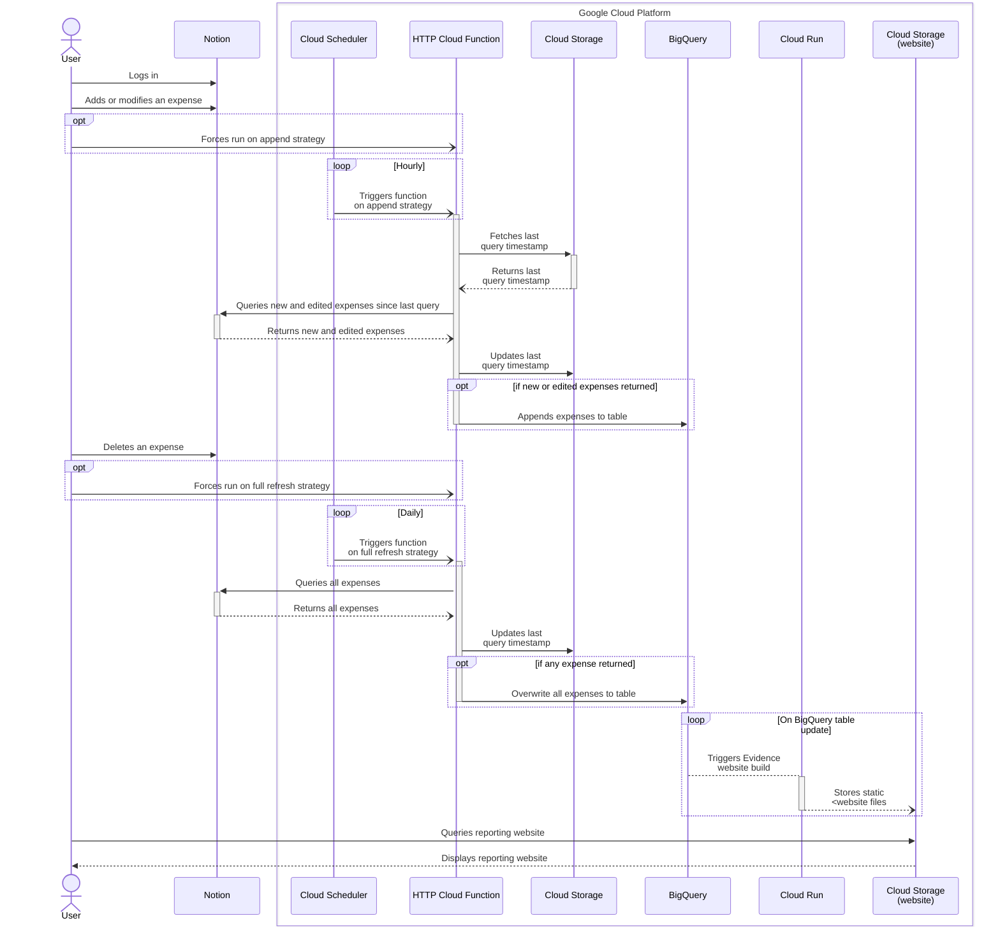

<!-- Improved compatibility of back to top link: See: https://github.com/othneildrew/Best-README-Template/pull/73 -->
<a name="readme-top"></a>

<!-- PROJECT LOGO -->
<br />
<div align="center">
  <!-- <a href="https://github.com/tucared/notion-budget-tracker">
    
  </a> -->

<h1 align="center">Notion Budget Tracker</h1>

  <strong><p align="center">
    Self-hosted expense tracker with reporting website</strong>
    <br />
    <a href="https://www.notion.so/3b78e071709e4a28ab16798de93e12c6?v=e8126179c6b64a029d8e20675dc4e48e">View expense logger demo</a>
    ·
    <a href="https://github.com/tucared/notion-budget-tracker">[TODO] View reporting website demo</a>
  </p>
</div>

<!-- TABLE OF CONTENTS -->
<details>
  <summary>Table of Contents</summary>
  <ol>
    <li>
      <a href="#about-the-project">About The Project</a>
      <ul>
        <li><a href="#built-with">Built With</a></li>
      </ul>
    </li>
    <li>
      <a href="#getting-started">Getting Started</a>
      <ul>
        <li><a href="#prerequisites">Prerequisites</a></li>
        <li><a href="#installation">Installation</a></li>
            <ul>
                <li><a href="#setup-your-notion-database">Setup your Notion database</a></li>
                <li><a href="#setup-your-local-repository">Setup your local repository</a></li>
                <li><a href="#create-a-billing-enabled-google-cloud-project">Create a billing-enabled Google Cloud project</a></li>
                <li><a href="#setup-account-impersonation-when-running-terragruntopentofu">Setup account impersonation when running Terragrunt/OpenTofu</a></li>
                <li><a href="#deploy-your-infrastructure">Deploy your infrastructure</a></li>
            </ul>
        <li><a href="#clean-up">Clean-up</a></li>
      </ul>
    </li>
    <li>
        <a href="#usage">Usage</a>
        <ul>
            <li><a href="#invoking-function">Invoking function</a></li>
            <li><a href="#visualising-logs-and-metadata">Visualising logs and metadata</a></li>
            <li><a href="#sequence-diagram">Sequence diagram</a></li>
        </ul>
    </li>
    <li><a href="#roadmap">Roadmap</a></li>
    <li>
        <a href="#local-development">Local development</a>
        <ul>
            <li><a href="#cloud-function">Cloud Function</a></li>
            <ul>
                <li><a href="#running-cloud-function-locally-with-functions-framework">Running Cloud Function locally with `functions-framework`</a></li>
            </ul>
            <li><a href="#cloud-infrastructure">Cloud infrastructure</a></li>
            <ul>
                <li><a href="#watch-costs-using-infracost">Watch costs using Infracost</a></li>
            </ul>
        </ul>
    </li>
    <li><a href="#contributing">Contributing</a></li>
    <li><a href="#license">License</a></li>
    <li><a href="#contact">Contact</a></li>
  </ol>
</details>

<!-- ABOUT THE PROJECT -->
## About The Project

This project aims at providing individuals and groups of individuals with a lightweight solution to record expenses and visualise related insights to drive better financial decisions.

The main requirements for the project are:

- Reduce user friction regarding transactions data collection.
- Integrate with a wide variety of banks, regardless of digitalisation or regulatory frameworks.
- Be conscious of data privacy and of data security.
- Allow for expense metadata fields customisation, initially aimed at expense categories.
- Be free, or extremely low price.

<p align="right">(<a href="#readme-top">back to top</a>)</p>

### Built With

- [![OpenTofu][OpenTofu.org]][OpenTofu-url]
- [![Terragrunt][Terragrunt.io]][Terragrunt-url]
- [![Python][Python.org]][Python-url]
- [![Notion][Notion.so]][Notion-url] _(free tier)_
- [![Google Cloud][Console.cloud.google.com]][Google-Cloud-url] _(free tier)_

<p align="right">(<a href="#readme-top">back to top</a>)</p>

<!-- GETTING STARTED -->
## Getting Started

To get a copy of the project up and running follow the steps below.

### Prerequisites

- A [Notion account]
- A [Google Cloud billing account]
- Have [gcloud CLI] installed
- Have [OpenTofu] installed
- Have [Terragrunt] installed

<p align="right">(<a href="#readme-top">back to top</a>)</p>

### Installation

#### Setup your Notion database

1. Duplicate this [Notion public template database] into a Workspace you own.

2. [Setup an internal Notion integration] with **Read content** capability, and [add it as a connection to your database].

#### Setup your local repository

1. Duplicate the `terragrunt/example` folder and rename it to `terragrunt/prod`.

     ```shell
     cp -a terragrunt/example terragrunt/prod
     ```

2. Edit values from `terragrunt/prod/env_vars.yaml` as followed:
   - **project_id**: A globally unique identifier for your project.
     > See [how to pick a project ID].
   - **notion_database_id**: The globally unique identifier for the Notion database created in step 1.
     > See [how to retrieve a database ID].
   - **notion_secret_value**: The unique internal integration token for the Notion integration created in step 2.
     > See [how to retrieve an integration token][Setup an internal Notion integration].

#### Create a billing-enabled Google Cloud project

1. Set billing account ID variable in shell
   > **BILLING_ACCOUNT_ID** can be found using `gcloud beta billing accounts list`

   ```shell
   export BILLING_ACCOUNT_ID=...
   ```

2. Create project, link billing account and enable relevant APIs

   ```shell
   cd terragrunt/prod

   export PROJECT_ID=$(grep "project_id" env_vars.yaml | awk '{print $2}' | tr -d '"')
   gcloud projects create $PROJECT_ID
   gcloud beta billing projects link $PROJECT_ID --billing-account=$BILLING_ACCOUNT_ID

   gcloud services enable secretmanager.googleapis.com --project=$PROJECT_ID
   gcloud services enable cloudfunctions.googleapis.com --project=$PROJECT_ID
   gcloud services enable cloudscheduler.googleapis.com --project=$PROJECT_ID
   gcloud services enable run.googleapis.com --project=$PROJECT_ID
   gcloud services enable cloudbuild.googleapis.com --project=$PROJECT_ID
   gcloud services enable artifactregistry.googleapis.com --project=$PROJECT_ID
   gcloud services enable iam.googleapis.com --project=$PROJECT_ID
   gcloud services enable cloudresourcemanager.googleapis.com --project=$PROJECT_ID
   ```

#### Setup account impersonation when running Terragrunt/OpenTofu

1. Unset any previous Google credentials set.

    ```shell
    unset GOOGLE_CREDENTIALS
    gcloud auth application-default login --no-launch-browser
    ```

2. Create a service account used for impersonation.

    ```shell
    cd terragrunt/prod
    ```

    <details><summary><b>Long shell command to execute</b></summary>

    ```shell
    export PROJECT_ID=$(grep "project_id" env_vars.yaml | awk '{print $2}' | tr -d '"')
    export TOFU_SERVICE_ACCOUNT=$(grep "sa_tofu" env_vars.yaml | awk '{print $2}' | tr -d '"')
    export USER_ACCOUNT_ID=$(echo `gcloud config get core/account`)

    gcloud iam service-accounts create $TOFU_SERVICE_ACCOUNT \
        --display-name "OpenTofu SA" \
        --description "Used when running OpenTofu commands" \
        --project $PROJECT_ID

    gcloud projects add-iam-policy-binding $PROJECT_ID \
        --member "serviceAccount:$TOFU_SERVICE_ACCOUNT@$PROJECT_ID.iam.gserviceaccount.com" \
        --project $PROJECT_ID \
        --role "roles/editor"

    gcloud projects add-iam-policy-binding $PROJECT_ID \
        --member "serviceAccount:$TOFU_SERVICE_ACCOUNT@$PROJECT_ID.iam.gserviceaccount.com" \
        --project $PROJECT_ID \
        --role "roles/secretmanager.admin"

    gcloud projects add-iam-policy-binding $PROJECT_ID \
        --member "serviceAccount:$TOFU_SERVICE_ACCOUNT@$PROJECT_ID.iam.gserviceaccount.com" \
        --project $PROJECT_ID \
        --role "roles/bigquery.dataEditor"

    gcloud projects add-iam-policy-binding $PROJECT_ID \
        --member "serviceAccount:$TOFU_SERVICE_ACCOUNT@$PROJECT_ID.iam.gserviceaccount.com" \
        --project $PROJECT_ID \
        --role "roles/iam.serviceAccountCreator"

    gcloud projects add-iam-policy-binding $PROJECT_ID \
        --member "serviceAccount:$TOFU_SERVICE_ACCOUNT@$PROJECT_ID.iam.gserviceaccount.com" \
        --project $PROJECT_ID \
        --role "roles/resourcemanager.projectIamAdmin"

    gcloud projects add-iam-policy-binding $PROJECT_ID \
        --member "serviceAccount:$TOFU_SERVICE_ACCOUNT@$PROJECT_ID.iam.gserviceaccount.com" \
        --project $PROJECT_ID \
        --role "roles/cloudfunctions.developer"

    gcloud projects add-iam-policy-binding $PROJECT_ID \
        --member "serviceAccount:$TOFU_SERVICE_ACCOUNT@$PROJECT_ID.iam.gserviceaccount.com" \
        --project $PROJECT_ID \
        --role "roles/cloudscheduler.admin"

    gcloud projects add-iam-policy-binding $PROJECT_ID \
        --member "serviceAccount:$TOFU_SERVICE_ACCOUNT@$PROJECT_ID.iam.gserviceaccount.com" \
        --project $PROJECT_ID \
        --role "roles/run.admin"

    gcloud iam service-accounts add-iam-policy-binding \
        $TOFU_SERVICE_ACCOUNT@$PROJECT_ID.iam.gserviceaccount.com \
        --project $PROJECT_ID \
        --member "user:$USER_ACCOUNT_ID" \
        --role "roles/iam.serviceAccountTokenCreator"
    ```

    </details>

#### Deploy your infrastructure

```shell
terragrunt apply

# Remote state GCS bucket ...-tfstate does not exist [...]. Would you like Terragrunt to create it? (y/n) y

# Do you want to perform these actions?
# Enter a value: yes
```

<p align="right">(<a href="#readme-top">back to top</a>)</p>

### Clean-up

You have 2 options for cleaning up deployment:

- Either remove all provisionned resources, except for the bucket containing eventual remote state file.

    ```shell
    terragrunt destroy
    # Enter a value: yes
    ```

- Or delete project, and eventual `backend.tf` file.

    ```shell
    gcloud projects delete $PROJECT_ID
    # Do you want to continue (Y/n)?: Y

    rm -rf .terraform.lock.hcl
    rm -rf .terragrunt-cache 
    ```

<p align="right">(<a href="#readme-top">back to top</a>)</p>

<!-- USAGE EXAMPLES -->
## Usage

- The **User** manually logs each expense as a [Page] in a [Notion database] with some metadata.
- Either the User, or the **Cloud Scheduler**, invokes a private **HTTP Cloud Function** to extract either all or new and updated Pages from aforementioned Notion database, then loads them into a **BigQuery** native table.
- **TODO**: An **[Evidence.dev]** IAM-protected static website provides visualisations, built each time BigQuery table data is updated.

### Invoking function

Function can be triggered either by invoking it directly or by force running the scheduler that invokes it:

- Calling function directly (append strategy)

    ```shell
    curl -i -X POST $(terragrunt output function_uri | sed 's/"//g') \
        -H "Authorization: bearer $(gcloud auth print-identity-token)"
    ```

- Calling function directly (full refresh strategy)

    ```shell
    curl -i -X POST $(terragrunt output function_uri | sed 's/"//g')\?full_refresh=true \
        -H "Authorization: bearer $(gcloud auth print-identity-token)"
    ```

- Force running scheduler (append strategy)

    ```shell
    gcloud scheduler jobs run $(terragrunt output scheduler_append_name | sed 's/"//g') \
        --project=$(grep "project_id" env_vars.yaml | awk '{print $2}' | tr -d '"') \
        --location=$(terragrunt output scheduler_append_region | sed 's/"//g')
    ```

- Force running scheduler (full refresh strategy)
  
    ```shell
    gcloud scheduler jobs run $(terragrunt output scheduler_full_refresh_name | sed 's/"//g') \
        --project=$(grep "project_id" env_vars.yaml | awk '{print $2}' | tr -d '"') \
        --location=$(terragrunt output scheduler_full_refresh_region | sed 's/"//g')
    ```

<p align="right">(<a href="#readme-top">back to top</a>)</p>

### Visualising logs and metadata

Cloud Function logs:

```shell
gcloud functions logs read $(terragrunt output function_name | sed 's/"//g') \
    --project=$PROJECT_ID \
    --region=$(terragrunt output function_region | sed 's/"//g')
```

Destination table metadata, including last updated time:

```shell
bq show $(terragrunt output bq_table_id_colon | sed 's/"//g')
```

Recent additions to destination table:

```shell
bq query --use_legacy_sql=false \
    "SELECT
        id,
        url,
        created_time,
        last_edited_time
    FROM
        \`$(terragrunt output bq_table_id | sed 's/"//g')\`
    ORDER BY last_edited_time DESC
    LIMIT 10;"
```

<p align="right">(<a href="#readme-top">back to top</a>)</p>

### Sequence diagram



<p align="right">(<a href="#readme-top">back to top</a>)</p>

<!-- ROADMAP -->
## Roadmap

- [ ] Add data modelling (local [dbt-core](https://github.com/dbt-labs/dbt-core)?)
- [ ] Add visualisation with [Evidence.dev]
- [ ] Add Automated transaction collection with [SimpleFIN Bridge]
- [ ] Add budgeting feature (i.e., target versus actual)

<p align="right">(<a href="#readme-top">back to top</a>)</p>

<!-- HOW TO DEVELOP LOCALLY -->
## Local development

### Cloud Function

Follow steps below to be able to test changes you made to Cloud Function source.

1. (_Optional_) [Setup and deploy](#installation) a development project (e.g., `terragrunt/dev`)

2. Pause Cloud Schedulers to prevent the deployed Cloud Function to be triggered automatically.

    ```yaml
    # terragrunt/dev/env_vars.yaml
    cloud_schedulers:
        paused: true
    ```

    ```shell
    cd terragrunt/dev
    terragrunt apply
    ```

3. Either:
   - Edit [Cloud Function source files](/cloud-functions/notion-to-bigquery/), [deploy changes](#deploy-your-infrastructure) and [invoke function](#invoking-function).

   - Run function locally using [`functions-framework`].

4. If you performed step 1., eventually [clean-up your deployment](#clean-up).

#### Running Cloud Function locally with `functions-framework`

1. Navigate to `terragrunt/` subfolder corresponding to test infrastructure.

    ```shell
    cd terragrunt/dev
    ```

2. Download service account key file used for Cloud Function.

    ```shell
    export GOOGLE_APPLICATION_CREDENTIALS_PATH=../../cloud-function/secret/$(echo "${PWD##*/}")_sa-key.json
    gcloud iam service-accounts keys create $GOOGLE_APPLICATION_CREDENTIALS_PATH \
        --iam-account=$(terragrunt output sa_email_cloud_function | sed 's/"//g')
    ```

3. [Create a virtual environment and] install dependencies.

    ```shell
    export SOURCE=../../cloud-function/source
    pip install -r $SOURCE/requirements.txt
    pip install -r $SOURCE/requirements.local.txt
    ```

4. Start local server.

    ```shell
    export GOOGLE_APPLICATION_CREDENTIALS_PATH=../../cloud-function/secret/$(echo "${PWD##*/}")_sa-key.json
    export PROJECT_ID=$(grep "project_id" env_vars.yaml | awk '{print $2}' | tr -d '"')
    export ENTRYPOINT=$(grep "entrypoint" ../common_vars.yaml | awk '{print $2}' | tr -d '"')
    export SOURCE=../../cloud-function/source

    export TG_OUTPUT=$(tg output -json function_env_vars)
    eval "$(echo "$TG_OUTPUT" | jq -r 'to_entries | .[] | "export \(.key)=\"\(.value)\""')"

    GOOGLE_APPLICATION_CREDENTIALS=$(echo $GOOGLE_APPLICATION_CREDENTIALS_PATH) \
    GOOGLE_CLOUD_PROJECT=$(echo $PROJECT_ID) \
    DATA_FILE_PATH=../../cloud-function/data/$(echo "${PWD##*/}")_notion.json \
    functions-framework \
        --target=$ENTRYPOINT \
        --source=$SOURCE/main.py \
        --debug
    ```

    > Source changes are automatically loaded to local server, meaning you can code the function and invoking its latest version without restarting the local server.

5. Open another shell, and invoke function locally.

    ```shell
    # Append strategy
    curl localhost:8080

    # Full refresh strategy
    curl "localhost:8080?full_refresh=true"
    ```

<p align="right">(<a href="#readme-top">back to top</a>)</p>

### Cloud infrastructure

#### Watch costs using [Infracost]

> [!NOTE]
> As mentionned earlier, **deploying this infrastructure costs nothing as it leverages Google Cloud Free Tier**.

[Infracost] is a CLI-based tool that provides a cloud monthly cost estimate from `.tf` files and a [`infracost-usage.yml`](infracost-usage.yml) file.

When modifying resources, before deploying resources or commiting to repo, it can be insightful to use Infracost to highlight costs spikes:

```shell
export TG_DIR=terragrunt/dev/
infracost breakdown --path=$TG_DIR \
    --usage-file=infracost-usage.yml
```

> [!IMPORTANT]
> [Infracost specifies] free trials and free tiers, which are usually **not** a significant part of cloud costs, are ignored.
> Meaning Infracost is intended as a necessary, but unsufficient tool:
>
> - It will most likely display a non-zero cost;
>
> - If this cost is low (i.e., few cents), you should still verify your usage remains within the Free tier;
>
> - If this cost is high, this may indicate you are not under Free Tier anymore.

<p align="right">(<a href="#readme-top">back to top</a>)</p>

<!-- CONTRIBUTING -->
## Contributing

Contributions are what make the open source community such an amazing place to learn, inspire, and create. Any contributions you make are **greatly appreciated**.

If you have a suggestion that would make this better, please fork the repo and create a pull request. You can also simply open an issue with the tag "enhancement".
Don't forget to give the project a star! Thanks again!

1. Fork the Project
2. Create your Feature Branch (`git checkout -b feature/AmazingFeature`)
3. Commit your Changes (`git commit -m 'Add some AmazingFeature'`)
4. Push to the Branch (`git push origin feature/AmazingFeature`)
5. Open a Pull Request

<p align="right">(<a href="#readme-top">back to top</a>)</p>

<!-- LICENSE -->
## License

Distributed under the MIT License. See `LICENSE` for more information.

<p align="right">(<a href="#readme-top">back to top</a>)</p>

<!-- CONTACT -->
## Contact

Tucared - <1v8ufskf@duck.com>

<p align="right">(<a href="#readme-top">back to top</a>)</p>

<!-- MARKDOWN LINKS & IMAGES -->
<!-- https://www.markdownguide.org/basic-syntax/#reference-style-links -->
[OpenTofu.org]: https://img.shields.io/badge/OpenTofu-FFDA18?style=for-the-badge&logo=opentofu&logoColor=black
[OpenTofu-url]: https://opentofu.org/
<!-- https://github.com/simple-icons/simple-icons/issues/7650 -->
[Terragrunt.io]: https://img.shields.io/badge/terragrunt-565AE1?style=for-the-badge&logo=terragrunt
[Terragrunt-url]: https://terragrunt.gruntwork.io/
[Python.org]: https://img.shields.io/badge/Python-FFD43B?style=for-the-badge&logo=python&logoColor=blue
[Python-url]: https://www.python.org/
[Notion.so]: https://img.shields.io/badge/Notion-000000?style=for-the-badge&logo=notion&logoColor=white
[Notion-url]: https://www.notion.so/
[Console.cloud.google.com]: https://img.shields.io/badge/Google_Cloud-4285F4?style=for-the-badge&logo=google-cloud&logoColor=white
[Google-Cloud-url]: https://console.cloud.google.com

[Notion account]: https://www.notion.so/signup
[Google Cloud billing account]: https://cloud.google.com/billing/docs/how-to/create-billing-account
[gcloud CLI]: https://cloud.google.com/sdk/docs/install
[OpenTofu]: https://opentofu.org/docs/intro/install/
[Terragrunt]: https://terragrunt.gruntwork.io/docs/getting-started/install/

[Notion public template database]: https://adjoining-heath-cac.notion.site/ae50475a83bd40edbced0544315364fa?v=d212f11f17c646cc862983622904c8bb
[Setup an internal Notion integration]: https://developers.notion.com/docs/authorization#internal-integration-auth-flow-set-up
[add it as a connection to your database]: https://www.notion.so/help/add-and-manage-connections-with-the-api#add-connections-to-pages
[how to retrieve a database ID]: https://developers.notion.com/reference/retrieve-a-database
[how to pick a project ID]: https://cloud.google.com/resource-manager/docs/creating-managing-projects#before_you_begin

[Page]: https://developers.notion.com/reference/page
[Notion database]: https://developers.notion.com/reference/database

[`functions-framework`]: https://github.com/GoogleCloudPlatform/functions-framework-python
[Evidence.dev]: https://evidence.dev/
[Infracost]: https://github.com/infracost/infracost/tree/master
[SimpleFin Bridge]: https://beta-bridge.simplefin.org/

[Infracost specifies]: https://www.infracost.io/docs/supported_resources/google/
