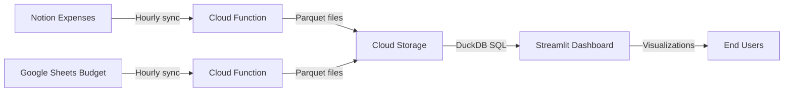

<div align="center">
<h1 align="center">Personal Expense Tracker</h1>

  <strong><p align="center">
    A data lakehouse for tracking personal expenses in Notion against a monthly budget in Google Sheets</strong>
  </p>

  
</div>

## What Is This?

A ready-to-deploy expense tracking system that:

- **Logs expenses in Notion**: Track your daily expenses with date, amount, category, and payment method
- **Manages budgets in Google Sheets**: Set and adjust monthly budget allocations by category
- **Visualizes spending**: Interactive Streamlit dashboard to monitor budget consumption by day and category
- **Automates data pipelines**: Scheduled syncs between Notion, Google Sheets, and your data lake
- **Runs on GCP free tier**: Cloud-native infrastructure with minimal costs

This system combines the ease of logging expenses in Notion with the flexibility of budget management in Google Sheets, all visualized in an intuitive dashboard.

## Getting Started

### Prerequisites

- **Accounts & Templates**:
  - [Notion account](https://www.notion.so/signup) with [expense template](https://www.notion.so/1e81ed43cd7081609485d8f73c0d5e36?v=1e81ed43cd7081f88063000c38133b27) (**duplicate this template to your workspace**)
  - [Google Sheets budget template](https://docs.google.com/spreadsheets/d/1mf3u9zqNAhXSNc7v2GYphqUjYIN6PHYEgjTAHuvD50M/edit?gid=0#gid=0) (**make a copy** to your Drive)
  - [Google Cloud billing account](https://cloud.google.com/billing/docs/how-to/create-billing-account) (most resources stay within free tier)

- **CLI Tools**:
  - [gcloud CLI](https://cloud.google.com/sdk/docs/install) with current auth
  - [OpenTofu](https://opentofu.org/docs/intro/install/) for infrastructure
  - [Terragrunt](https://terragrunt.gruntwork.io/docs/getting-started/install/) for infrastructure orchestration

### Quick Start Guide

#### 1. Configure Notion Integration

1. [Create an internal Notion integration](https://developers.notion.com/docs/authorization#internal-integration-auth-flow-set-up)
   - Name your integration (e.g., "Expense Tracker")
   - Set read permissions only (no write access needed)

2. [Connect the integration to your expense database](https://www.notion.so/help/add-and-manage-connections-with-the-api#add-connections-to-pages)
   - Share your expense database with the integration
   - Copy your integration's secret key for the next steps

#### 2. Configure Google Sheets Access

1. Create a copy of the [budget template](https://example.com/sheets-budget-template)
2. Note the Sheet ID from the URL (the long string between `/d/` and `/edit`)
3. You'll need to share this sheet with the service account later

#### 3. Configure Local Environment

```shell
# Create your environment configuration from example
cp -a terragrunt/example terragrunt/prod

# Edit configuration files
nano terragrunt/prod/env_vars.yaml
```

Update `env_vars.yaml` with:

- `project_id`: A unique GCP project identifier (create a new one)
- `notion_pipeline.notion_api_key`: Your Notion integration secret
- `notion_pipeline.notion_database_id`: Your expense database ID
- `gsheets_pipeline.sheet_id`: Your budget sheet ID
- `data_explorer.auth_username`: Username for dashboard access
- `data_explorer.auth_password`: Secure password for dashboard access
- Optional: Adjust scheduler timing, region, etc.

#### 4. Provision Google Cloud Environment

```shell
# Authenticate with Google Cloud
gcloud auth application-default login

# Set environment variables
export BILLING_ACCOUNT_ID=$(gcloud billing accounts list --format="value(ACCOUNT_ID)" --limit=1)
cd terragrunt/prod
export PROJECT_ID=$(grep "project_id" env_vars.yaml | awk '{print $2}' | tr -d '"')

# Create and configure project
gcloud projects create $PROJECT_ID
gcloud beta billing projects link $PROJECT_ID --billing-account=$BILLING_ACCOUNT_ID

# Enable required APIs
gcloud services enable \
  secretmanager.googleapis.com cloudfunctions.googleapis.com \
  cloudscheduler.googleapis.com \
  run.googleapis.com cloudbuild.googleapis.com \
  artifactregistry.googleapis.com \
  iam.googleapis.com \
  cloudresourcemanager.googleapis.com \
  drive.googleapis.com \
  sheets.googleapis.com \
  --project=$PROJECT_ID
```

#### 5. Deploy Infrastructure

```shell
# Deploy all infrastructure components
terragrunt apply
```

#### 6. Share Google Sheet with Service Account

```shell
# Get the service account email to share your Google Sheet with
echo "Google Sheets Service Account: $(terragrunt output -raw data_bucket_writer_service_account_email)"
```

Share your budget Google Sheet with this service account email (Editor access).

#### 7. Access Your Expense Tracker

After deployment completes:

```shell
# Get expense dashboard URL
echo "Expense Dashboard URL: $(terragrunt output -raw data_explorer_service_url)"

# Trigger initial data load
curl -i -X POST $(terragrunt output -raw notion_pipeline_function_uri) \
    -H "Authorization: bearer $(gcloud auth print-identity-token)"
curl -i -X POST $(terragrunt output -raw gsheets_pipeline_function_uri) \
    -H "Authorization: bearer $(gcloud auth print-identity-token)"
```

## Using Your Expense Tracker

### Data Structure

**Notion Expense Database**:

- **Date**: When the expense occurred
- **Amount**: Cost in your currency
- **Category**: Expense category (must match budget categories)
- **Payment Method**: How you paid (cash, card, etc.)

**Google Sheets Budget**:

- Monthly budget allocations by category
- Categories must match those used in Notion

### Dashboard Features

The Streamlit dashboard provides:

1. **Budget Overview**: See total budget vs. actual spending
2. **Daily Consumption**: Track how much of your budget is used each day
3. **Category Breakdown**: Filter expenses by category
4. **Trend Analysis**: View spending patterns over time

> **Authentication**: The dashboard uses secure username/password authentication with credentials configured via Terragrunt variables. Passwords are stored securely in Google Secret Manager and never committed to the repository.

### Data Flow Process



> **Note**: Both Notion and Google Sheets data are synced hourly by default. You can customize the sync frequency for each pipeline in the `env_vars.yaml` file before deployment.

### Managing Data Refresh

**Manual Data Refresh:**

```shell
# Refresh Notion expense data
export FUNCTION_URI=$(terragrunt output -raw notion_pipeline_function_uri)
curl -i -X POST $FUNCTION_URI -H "Authorization: bearer $(gcloud auth print-identity-token)"

# Refresh Google Sheets budget data
export FUNCTION_URI=$(terragrunt output -raw gsheets_pipeline_function_uri)
curl -i -X POST $FUNCTION_URI -H "Authorization: bearer $(gcloud auth print-identity-token)"
```

## Local Development

For developers who want to test pipelines locally before deploying to the cloud:

```shell
# Navigate to your environment directory
cd terragrunt/dev

# Run a local pipeline (e.g., Notion)
# Run `chmod +x ../../opentofu/scripts/run_local.sh`the first time
../../opentofu/scripts/run_local.sh notion_pipeline

# In another terminal, trigger the local function
curl localhost:8080
```

The `run_local.sh` script handles service account impersonation and automatically resets your credentials after testing. It works with any pipeline in the system.

## Cost Management

This solution uses GCP's [free tier](https://cloud.google.com/free) resources:

| Component | Free Tier Limit | Typical Usage |
|-----------|-----------------|---------------|
| Cloud Storage | 5GB | < 1GB for personal expense data |
| Cloud Functions | 2M invocations | ~1,440 invocations/month (hourly) |
| Cloud Run | 2M requests, 360K GB-seconds | Well below with periodic usage |
| Cloud Scheduler | 3 jobs | 2 jobs used (Notion + Google Sheets) |

## Architecture

This project uses a modular architecture:

- **Base Pipeline Module**: Core infrastructure for all data pipelines
- **Specific Pipeline Modules**: Implementations for Notion and Google Sheets
- **Data Explorer**: Dashboard for viewing and analyzing expense data

All pipelines follow the same pattern of extracting data from the source, transforming it with the DLT framework, and loading it into the data bucket.

## Troubleshooting

### Common Issues

- **Expenses not showing up?** Check Cloud Function logs and verify Notion API connection
- **Budget data missing?** Ensure you've shared your Google Sheet with the service account
- **Categories not matching?** Ensure category names in Notion exactly match those in your budget sheet
- **Dashboard not loading?** Ensure Cloud Build trigger has completed successfully

### Updating the System

```shell
# Pull latest code
git pull

# Apply infrastructure changes
terragrunt apply

# Rebuild dashboard app if needed
gcloud builds triggers run $(terragrunt output -raw data_explorer_build_trigger_name) \
    --region=$(terragrunt output -raw data_explorer_build_trigger_region)
```

## Cleanup

```shell
# Remove all resources
terragrunt destroy

# For complete removal, delete the project
gcloud projects delete $PROJECT_ID
```

## Customization

- **Adding expense categories**: Add new categories in both Notion and Google Sheets. **Important**: Ensure category names match exactly between Notion and Google Sheets for proper mapping in the dashboard.
- **Budget periods**: If you want to modify the budget period structure in Google Sheets (columns or periods), you will need to update the Streamlit app code as well to ensure proper data handling and visualization.
- **Custom visualizations**: Modify the Streamlit app in `opentofu/modules/data_explorer/app/`
- **Adding new pipelines**: Create a new module that uses the base_pipeline module and add its specific configuration to `env_vars.yaml`

## License

Distributed under the MIT License. See `LICENSE` for more information.

## Contact

Tucared - <1v8ufskf@duck.com>

Project Link: [https://github.com/tucared/lakehouse-starter](https://github.com/tucared/lakehouse-starter)
